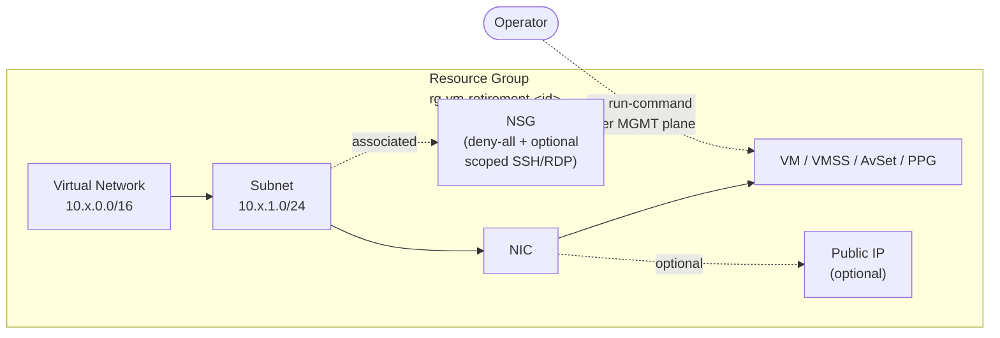

# Azure VM Retirement Lab

> **Battle-tested Terraform lab + L1 operations runbook for safely migrating Azure
> IaaS VMs ahead of Dv2 / Dsv2 / Bv1 retirement (and the end of 1- and 3-year
> Reserved Instances for Dv3 / Dv4).**

[](https://developer.hashicorp.com/terraform)
[](https://learn.microsoft.com/azure/virtual-machines/)
[](LICENSE)
[](CONTRIBUTING.md)

This repository ships **9 self-contained Terraform scenarios** that reproduce the
real-world edge cases you will hit while resizing Azure VMs across families — temp
disk loss, SCSI → NVMe controller switch, Generation 1 boot blockers, Availability
Sets, Proximity Placement Groups, Scale Sets, and Azure Hybrid Benefit. Every
scenario was executed end-to-end against live Azure infrastructure and the
operational guide condenses the findings into a reusable L1 runbook.

---

## Table of contents

1. [Why this lab exists](#why-this-lab-exists)
2. [Repository layout](#repository-layout)
3. [Scenario catalog](#scenario-catalog)
4. [Architecture at a glance](#architecture-at-a-glance)
5. [Decision flow: which path do I take?](#decision-flow-which-path-do-i-take)
6. [Cross-scenario findings](#cross-scenario-findings)
7. [Quick start](#quick-start)
8. [Network plan (CIDR map)](#network-plan-cidr-map)
9. [Naming & tagging conventions](#naming--tagging-conventions)
10. [Security model](#security-model)
11. [Operational guide](#operational-guide)
12. [References](#references)
13. [License](#license)

---

## Why this lab exists

Microsoft has announced an unusually high number of VM size retirements in 2025-2026.
The dates that matter for most customers:

| Series | Retirement date |
|---|---|
| `NVv3`, `NVv4` | 2026-09-30 |
| `Msv2 / Mdsv2` (M192 SKUs) | 2027-03-31 |
| `NP-series`, `HBv2`, `HC-series` | 2027-05-31 |
| `D`, `Ds`, `Dv2`, `Dsv2`, `Ls` | 2028-05-01 |
| `Av2`, `Amv2`, `Bv1`, `F`, `Fs`, `Fsv2`, `G`, `Gs`, `Lsv2` | 2028-11-15 |

In parallel, **1-year and 3-year Reserved Instances for `Dv3` / `Dv4` cannot be
renewed after 2026-07-01** — so even if you are not affected by a retirement today,
your cost base is about to change.

A resize **looks** simple ("just change the SKU"). In practice four traps regularly
break a migration:

1. The **temp disk** disappears when crossing `D{x}v5` ↔ `D{x}dv5` boundaries.
2. The **disk controller** switches from SCSI to NVMe in `v6` / `v7` and cannot be
   resized in place with a single field change.
3. **Generation 1** images cannot boot on the `v6` family.
4. **Azure Hybrid Benefit** flags can be silently lost when recreating a VM.

This lab reproduces each one in isolation so you can rehearse the procedure before
touching production.

---

## Repository layout

```text
azure-vm-retirement-lab/
├── core-vms/                          # 4 fundamental IaaS scenarios
│   ├── s01-direct-resize-linux/       # CORE-S01 · Linux happy-path resize
│   ├── s02-windows-tempdisk/          # CORE-S02 · Windows pagefile on temp disk
│   ├── s03-linux-tempdisk/            # CORE-S03 · Linux temp disk (/mnt) handling
│   └── s04-ahb-windows/               # CORE-S04 · Azure Hybrid Benefit lifecycle
├── advanced-vms/                      # 5 advanced primitives
│   ├── s01-scsi-nvme/                 # ADV-S01 · SCSI → NVMe controller switch
│   ├── s02-gen1-blocked/              # ADV-S02 · Gen1 vs Dsv5 vs v6
│   ├── s03-availability-set/          # ADV-S03 · Availability Set
│   ├── s04-ppg/                       # ADV-S04 · Proximity Placement Group
│   └── s05-vmss/                      # ADV-S05 · Virtual Machine Scale Set
├── docs/
│   └── diagrams.md                    # Mermaid diagrams (overview, flows, per scenario)
├── OPERATIONAL-GUIDE.md               # Full L1 runbook + technical article
├── SECURITY.md                        # Security policy
├── CONTRIBUTING.md                    # Contribution guide
├── LICENSE                            # MIT
└── README.md                          # This file
```

Each scenario folder is **self-contained**: its own Resource Group, its own VNet
(unique CIDR), its own Terraform state, its own `README.md` with the procedure.

---

## Scenario catalog

### Core scenarios (fundamental IaaS resize patterns)

| ID | Folder | Workload | OS | Pattern demonstrated |
|---|---|---|---|---|
| `CORE-S01` | [core-vms/s01-direct-resize-linux](core-vms/s01-direct-resize-linux/README.md) | Single Linux VM | Ubuntu 22.04 | Direct in-place resize `D2s_v3 → D2s_v5` (happy path) |
| `CORE-S02` | [core-vms/s02-windows-tempdisk](core-vms/s02-windows-tempdisk/README.md) | Single Windows VM | WS 2022 | Cross temp-disk boundary: move pagefile → snapshot → recreate with `--attach-os-disk` |
| `CORE-S03` | [core-vms/s03-linux-tempdisk](core-vms/s03-linux-tempdisk/README.md) | Single Linux VM | Ubuntu 22.04 | Why the Windows trap usually does not apply to default Ubuntu (cloud-init `ResourceDisk.EnableSwap=n`) |
| `CORE-S04` | [core-vms/s04-ahb-windows](core-vms/s04-ahb-windows/README.md) | Single Windows VM | WS 2022 | Activate AHB, prove it survives a cross-family resize, document the recreate caveat |

### Advanced scenarios (HA primitives & controller changes)

| ID | Folder | Resources | Pattern demonstrated |
|---|---|---|---|
| `ADV-S01` | [advanced-vms/s01-scsi-nvme](advanced-vms/s01-scsi-nvme/README.md) | 1 Gen2 Linux VM | Atomic PATCH `vmSize + diskControllerType` to move SCSI Dsv5 → NVMe Dasv6 |
| `ADV-S02` | [advanced-vms/s02-gen1-blocked](advanced-vms/s02-gen1-blocked/README.md) | 1 Gen1 Linux VM | Demonstrate that the real Gen1 boundary is `v6`, not `Dsv5` |
| `ADV-S03` | [advanced-vms/s03-availability-set](advanced-vms/s03-availability-set/README.md) | 1 AvSet + 2 VMs | Resize VMs that belong to an Availability Set (conservative runbook + fast path) |
| `ADV-S04` | [advanced-vms/s04-ppg](advanced-vms/s04-ppg/README.md) | 1 PPG + 2 VMs | Resize VMs that anchor a Proximity Placement Group |
| `ADV-S05` | [advanced-vms/s05-vmss](advanced-vms/s05-vmss/README.md) | 1 VMSS Uniform | Two-step VMSS resize: `vmss update --set sku.name` then `vmss update-instances` |

---

## Architecture at a glance

Every scenario follows the same minimalist template:



> **No inbound RDP / SSH is required.** All in-guest validation is performed
> through `az vm run-command invoke` and `az vmss run-command invoke`, which use
> the Azure management plane and bypass the data plane completely.

---

## Decision flow: which path do I take?

Use this tree to pick the scenario that matches your real workload **before**
touching production:

```mermaid
flowchart TD
    START([VM to be resized]) --> Q1{Target SKU<br/>requires NVMe?<br/>v6 / v7 / Ebsv5}
    Q1 -- No --> Q2{Crossing<br/>temp-disk boundary?<br/>D{x}v5 ↔ D{x}dv5}
    Q1 -- Yes --> Q3{Source VM is<br/>Generation 2?}

    Q3 -- No --> BLOCK[["🚫 STOP<br/>Gen1 cannot boot v6<br/>→ see ADV-S02"]]
    Q3 -- Yes --> NVME[["Use ADV-S01 pattern<br/>Atomic PATCH<br/>vmSize + diskControllerType"]]

    Q2 -- Yes, Windows --> WIN[["Use CORE-S02 pattern<br/>Move pagefile → snapshot →<br/>az vm create --attach-os-disk"]]
    Q2 -- Yes, Linux --> LIN[["Use CORE-S03 pattern<br/>Check swap on /mnt first<br/>Ubuntu cloud-init usually safe"]]
    Q2 -- No --> Q4{VM uses<br/>AvSet / PPG / VMSS?}

    Q4 -- AvSet --> AS[["Use ADV-S03 pattern<br/>Conservative: stop-all,<br/>resize-all, start-all"]]
    Q4 -- PPG --> PPG[["Use ADV-S04 pattern<br/>One-by-one resize, then<br/>re-anchor verified"]]
    Q4 -- VMSS --> VMSS[["Use ADV-S05 pattern<br/>vmss update --set sku.name<br/>+ update-instances"]]
    Q4 -- None --> Q5{Windows VM with<br/>Hybrid Benefit?}

    Q5 -- Yes --> AHB[["Use CORE-S04 pattern<br/>AHB survives resize,<br/>but verify after recreate"]]
    Q5 -- No --> DIRECT[["Use CORE-S01 pattern<br/>Direct in-place resize"]]
```

---

## Cross-scenario findings

These eight findings were extracted from the validation runs and are referenced
throughout the [OPERATIONAL-GUIDE.md](OPERATIONAL-GUIDE.md):

| # | Finding | Evidence | Practical implication |
|---|---|---|---|
| 1 | `Dsv5` **accepts Gen1 images**. The real Gen1 boundary is the `v6` family. | ADV-S02 | If you only need to leave `Dv3` / `Dv4`, you do not need to convert Gen1 → Gen2. Only required if you target `v6`. |
| 2 | Pagefile / swap on `/mnt` (temp disk) blocks resizes that cross the temp-disk boundary — not the family itself. | CORE-S02 vs CORE-S03 | Drain `/mnt` (move pagefile / swap) and reboot before the resize. Default Ubuntu cloud-init already leaves `/mnt` empty. |
| 3 | AHB **persists** across a cross-family resize. | CORE-S04 | No need to re-apply AHB after a SKU change. **But** after `az vm create --attach-os-disk` you must pass `--license-type Windows_Server` explicitly. |
| 4 | AvSet / PPG single-VM resize restrictions are **relaxed in modern regions** — it worked end-to-end. | ADV-S03, ADV-S04 | Useful to know, but **not guaranteed**. For production, default to `deallocate-all / resize-all / start-all`. |
| 5 | SCSI → NVMe requires an **atomic PATCH** (size + controllerType in the same call). Changing either field alone fails with `InvalidParameter`. | ADV-S01 | `az vm update --set hardwareProfile.vmSize=… storageProfile.diskControllerType=NVMe` (VM must be deallocated). |
| 6 | Ubuntu 22.04 Gen2 transparently remaps `/dev/sda` → `/dev/nvme0n1` after the controller switch. No `fstab` or `initramfs` work is needed. | ADV-S01 | Linux modern: zero prep. For Windows / older distros: validate NVMe drivers before. |
| 7 | VMSS Uniform + `Manual` upgrade mode lets you stage the new model SKU with zero blast radius and apply it in a controlled window. | ADV-S05 | Split `update-instances` calls into batches for a rolling effect. |
| 8 | Every validation was performed **without exposing inbound RDP / SSH**, using `az vm/vmss run-command invoke` on NSGs that deny all inbound traffic. | All scenarios | Reproducible secure pattern for any environment. |

---

## Quick start

### Prerequisites

| Tool | Minimum version | Purpose |
|---|---|---|
| [Terraform](https://developer.hashicorp.com/terraform/downloads) | `>= 1.6` | Deploy infrastructure |
| [Azure CLI](https://learn.microsoft.com/cli/azure/install-azure-cli) | `>= 2.60` | Authentication + run-command operations |
| Azure subscription | — | With quota for the target SKUs in your region |
| PowerShell 7 (or `bash`) | — | Execute the runbook snippets |

### Deploy a single scenario

```powershell
# 1. Authenticate
az login
az account set --subscription "<your-subscription-id-or-name>"

# 2. Pick a scenario
cd core-vms\s01-direct-resize-linux

# 3. Fill in the variables file
Copy-Item terraform.tfvars.example terraform.tfvars
# Edit terraform.tfvars: set a strong password and (optionally) lock allowed_source_ip
notepad terraform.tfvars

# 4. Deploy
terraform init
terraform apply -auto-approve

# 5. Follow the scenario README to perform the resize and validate

# 6. Tear down
terraform destroy -auto-approve
```

### Deploy multiple scenarios in parallel

Each scenario uses a unique CIDR and its own Resource Group, so you can apply
several at the same time from different shells without conflicts.

### Recovery after `--attach-os-disk` workflows

Scenarios that use `az vm create --attach-os-disk` (CORE-S02, optional fallback in
ADV-S01) diverge the Terraform state. After validating, reset the state:

```powershell
az group delete -g <rg-name> --yes --no-wait
Remove-Item terraform.tfstate*, .terraform.lock.hcl -Force
Remove-Item .terraform -Recurse -Force
```

---

## Network plan (CIDR map)

Each scenario uses a unique CIDR so multiple scenarios can coexist:

| Scenario | VNet CIDR | Subnet CIDR |
|---|---|---|
| `CORE-S01` | `10.11.0.0/16` | `10.11.1.0/24` |
| `CORE-S02` | `10.12.0.0/16` | `10.12.1.0/24` |
| `CORE-S03` | `10.13.0.0/16` | `10.13.1.0/24` |
| `CORE-S04` | `10.14.0.0/16` | `10.14.1.0/24` |
| `ADV-S01` | `10.21.0.0/16` | `10.21.1.0/24` |
| `ADV-S02` | `10.22.0.0/16` | `10.22.1.0/24` |
| `ADV-S03` | `10.23.0.0/16` | `10.23.1.0/24` |
| `ADV-S04` | `10.24.0.0/16` | `10.24.1.0/24` |
| `ADV-S05` | `10.25.0.0/16` | `10.25.1.0/24` |

---

## Naming & tagging conventions

Resource Groups: `rg-vm-retirement-<scenario>` (e.g. `rg-vm-retirement-core-s01`).

Default tags applied to every resource:

| Tag | Value |
|---|---|
| `Workload` | `demo` |
| `Owner` | `demo` |
| `Environment` | `Demo` |
| `project` | `azure-vm-retirement-runbook-lab` |
| `deleteAfter` | `2026-12-31` (override via `delete_after` variable) |
| `managedBy` | `terraform` |
| `scenario` | `CORE-S0x` / `ADV-S0x` |

Override `Workload` / `Owner` in your fork to match your tagging policy before
deploying into a shared subscription.

---

## Security model

This lab is engineered for **safe demonstration in any subscription**:

- 🔒 **No secrets in the repo.** `terraform.tfvars.example` ships placeholder
  passwords; `terraform.tfvars` is in `.gitignore`.
- 🔒 **No inbound RDP / SSH required.** Every in-guest action uses the Azure
  management plane (`az vm run-command invoke`). The NSG defaults to `deny-all`
  inbound. The only inbound rule (optional, scoped to `allowed_source_ip`) is
  there for users who explicitly want shell access for exploration.
- 🔒 **`allowed_source_ip` defaults to your declared CIDR.** You must set it in
  `terraform.tfvars`. There is no `0.0.0.0/0` fallback.
- 🔒 **Public IPs are opt-in** via the `enable_public_ips` variable.
- 🔒 **State files are local and gitignored.** State contains the admin password —
  if you adopt remote state, use an encrypted backend (Azure Storage with CMK,
  or Terraform Cloud).
- 🔒 **`prevent_deletion_if_contains_resources = false`** is set on the provider
  so `terraform destroy` and `az group delete` work without manual intervention.
  Do not reuse this provider block in production.

See [SECURITY.md](SECURITY.md) for the responsible disclosure policy.

---

## Operational guide

The standalone [OPERATIONAL-GUIDE.md](OPERATIONAL-GUIDE.md) is the L1 runbook the
lab was built to validate. It contains:

- A technical article on **why** Microsoft is retiring these series and what the
  replacements look like.
- A per-family migration guide (D / Ds / Dv2, HBv2, HC, M192, NVv3 / NVv4, NP).
- Four operational considerations (temp disk, SCSI vs NVMe, Windows licensing,
  Azure-SSIS IR).
- An L1 runbook with: execution sheet template, 13 stop conditions, 4-phase
  procedure, Resource Graph (KQL) queries for impact analysis, in-guest
  validation snippets for Windows and Linux, rollback checklist and a dedicated
  VMSS mini-runbook.

---

## References

- **Master document — [OPERATIONAL-GUIDE.md](OPERATIONAL-GUIDE.md)** — the full, unabridged technical guide and L1 operational runbook this lab is built from.
- [Retired VM sizes list (official)](https://learn.microsoft.com/azure/virtual-machines/sizes/retirement/retired-sizes-list)
- [`D / Ds / Dv2 / Dsv2 / Ls` migration guide](https://learn.microsoft.com/azure/virtual-machines/migration/sizes/d-ds-dv2-dsv2-ls-series-migration-guide)
- [Azure VMs without a local temp disk](https://learn.microsoft.com/azure/virtual-machines/azure-vms-no-temp-disk)
- [Resize VM (official)](https://learn.microsoft.com/azure/virtual-machines/sizes/resize-vm)
- [NVMe overview](https://learn.microsoft.com/azure/virtual-machines/nvme-overview)
- [Enable NVMe interface on existing VMs](https://learn.microsoft.com/azure/virtual-machines/enable-nvme-interface)
- [NVMe remote disks FAQ](https://learn.microsoft.com/azure/virtual-machines/enable-nvme-remote-faqs)
- [Azure Hybrid Benefit for Windows Server](https://learn.microsoft.com/azure/virtual-machines/windows/hybrid-use-benefit-licensing)
- [HC-series retirement](https://learn.microsoft.com/azure/virtual-machines/sizes/retirement/hc-series-retirement)

---

## License

[MIT](LICENSE) © 2026 GabeinCloud — Contributions welcome under the same license,
see [CONTRIBUTING.md](CONTRIBUTING.md).
