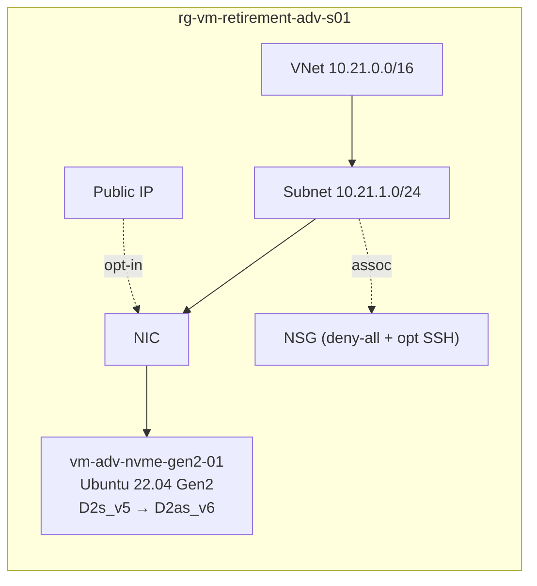
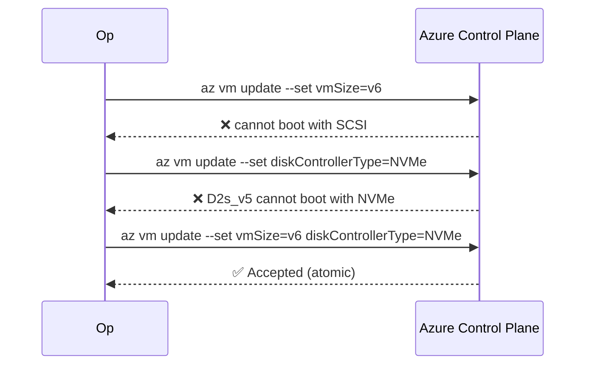

# ADV-S01 · SCSI → NVMe (atomic controller switch)

> **Pattern**: move a Gen2 Linux VM from `Standard_D2s_v5` (SCSI) to
> `Standard_D2as_v6` (NVMe-only) in place, using a single atomic PATCH that
> changes `vmSize` and `diskControllerType` in the same call.

## What this scenario proves

- Changing **only** `vmSize` to a v6 SKU fails:
  `Standard_D2as_v6 cannot boot with SCSI controller`.
- Changing **only** `diskControllerType` to NVMe fails:
  `Standard_D2s_v5 cannot boot with NVMe controller`.
- The **single supported path** is to change both fields in one
  `az vm update --set` call.
- Ubuntu 22.04 Gen2 transparently remaps `/dev/sda` → `/dev/nvme0n1` — no
  `fstab` / `initramfs` change required.
- Public IP, NIC, NSG and tags are preserved across the operation.

## Architecture



Decision flow:



## Files

`main.tf`, `variables.tf`, `terraform.tfvars.example`.

## Deploy

```powershell
Copy-Item terraform.tfvars.example terraform.tfvars
notepad terraform.tfvars

terraform init
terraform apply -auto-approve
```

## Procedure

```bash
RG=rg-vm-retirement-adv-s01
VM=vm-adv-nvme-gen2-01

# 1. Baseline
az vm show -g $RG -n $VM --query "{controller:storageProfile.diskControllerType, size:hardwareProfile.vmSize}"
az vm run-command invoke -g $RG -n $VM --command-id RunShellScript \
  --scripts 'uname -a; grep "model name" /proc/cpuinfo | head -1; lsblk -o NAME,TYPE,MOUNTPOINT'

# 2. Deallocate
az vm deallocate -g $RG -n $VM

# 3. Atomic PATCH (the ONLY supported path)
az vm update -g $RG -n $VM \
  --set hardwareProfile.vmSize=Standard_D2as_v6 \
        storageProfile.diskControllerType=NVMe

# 4. Start
az vm start -g $RG -n $VM

# 5. Validate
az vm show -g $RG -n $VM --query "{controller:storageProfile.diskControllerType, size:hardwareProfile.vmSize}"
az vm run-command invoke -g $RG -n $VM --command-id RunShellScript \
  --scripts 'uname -a; grep "model name" /proc/cpuinfo | head -1; lsblk -o NAME,TYPE,MOUNTPOINT'
```

## Expected outcome

- CPU changes from Intel (Dsv5 class) to AMD EPYC family (Genoa) on v6.
- Root device shifts from `/dev/sda` to `/dev/nvme0n1p1` (Ubuntu handles it).
- Public IP is unchanged.
- The whole resize completes in a few minutes (deallocate + update + start).

## Teardown

```powershell
terraform destroy -auto-approve
```

## References

- Background article: [OPERATIONAL-GUIDE.md](../../OPERATIONAL-GUIDE.md) — full master technical guide and L1 runbook for this lab.
- Microsoft: [`enable-nvme-remote-faqs`](https://learn.microsoft.com/azure/virtual-machines/enable-nvme-remote-faqs)
- Microsoft: [`nvme-overview`](https://learn.microsoft.com/azure/virtual-machines/nvme-overview)
- Microsoft: [`enable-nvme-interface`](https://learn.microsoft.com/azure/virtual-machines/enable-nvme-interface)
- Guide: [OPERATIONAL-GUIDE.md › SCSI vs NVMe](../../OPERATIONAL-GUIDE.md#scsi-vs-nvme-controller-the-invisible-trap-when-migrating-to-v6-or-v7)

---

## Cross-links

- [Volver al catálogo de escenarios](../../README.md#scenario-catalog)
- [Guía operacional y técnica](../../OPERATIONAL-GUIDE.md)
- Escenarios relacionados:
  - [ADV-S02 · Gen1 boot boundary](../s02-gen1-blocked/README.md)
  - [CORE-S01 · Linux resize directo](../../core-vms/s01-direct-resize-linux/README.md)
