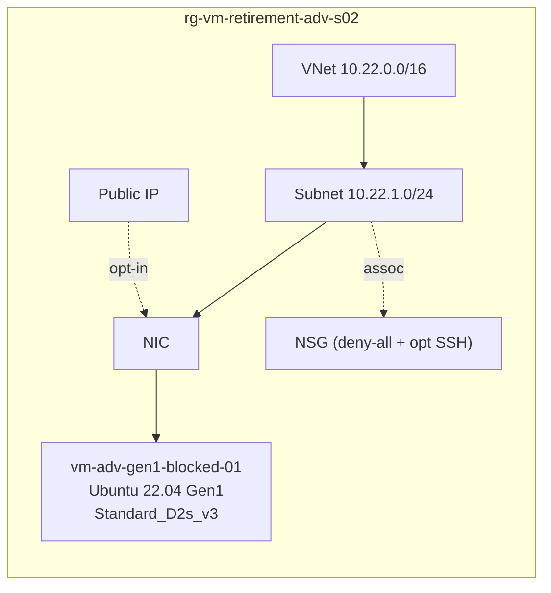

# ADV-S02 · Gen1 boot boundary

> **Pattern**: a Gen1 Linux VM. Used to confirm the **real** boundary for
> Generation 1 images: `Dsv5` accepts Gen1, but the `v6` family does not.

## What this scenario proves

- The widespread belief that "Gen1 cannot run on Dsv5" is **wrong** in modern
  regions. A resize `D2s_v3` (Gen1) → `D2s_v5` (Gen1) works.
- The real boundary is **v6**: attempting a resize to `Standard_D2as_v6` fails
  with `BadRequest: cannot boot Hypervisor Generation '1'`.
- The correct stop condition is "target is v6/v7 AND source is Gen1", not
  "target is Dsv5 AND source is Gen1".

## Architecture



## Files

`main.tf`, `variables.tf`, `terraform.tfvars.example`.

## Deploy

```powershell
Copy-Item terraform.tfvars.example terraform.tfvars
notepad terraform.tfvars

terraform init
terraform apply -auto-approve
```

## Procedure

```bash
RG=rg-vm-retirement-adv-s02
VM=vm-adv-gen1-blocked-01

# 1. Confirm the VM is Gen1
az vm get-instance-view -g $RG -n $VM --query hyperVGeneration -o tsv
# → V1

# 2. Resize within SCSI v5 (should WORK on Gen1)
az vm deallocate -g $RG -n $VM
az vm update     -g $RG -n $VM --set hardwareProfile.vmSize=Standard_D2s_v5
az vm start      -g $RG -n $VM

az vm run-command invoke -g $RG -n $VM --command-id RunShellScript \
  --scripts 'uname -a; grep "model name" /proc/cpuinfo | head -1'
# → boots fine on Sapphire Rapids / Ice Lake

# 3. Attempt to resize to v6 NVMe (should FAIL)
az vm deallocate -g $RG -n $VM
az vm update     -g $RG -n $VM \
  --set hardwareProfile.vmSize=Standard_D2as_v6 \
        storageProfile.diskControllerType=NVMe || true
# → BadRequest: cannot boot Hypervisor Generation 'V1' image on v6 SKU

# 4. Restore so destroy works cleanly
az vm update -g $RG -n $VM --set hardwareProfile.vmSize=Standard_D2s_v3
az vm start  -g $RG -n $VM
```

## Operational implication

If your target SKU is in v6/v7 and your source is Gen1, the resize is **not
the right path**. You must rebuild the VM from a Gen2 image and migrate the
data — this is an application migration, not a SKU change.

## Teardown

```powershell
terraform destroy -auto-approve
```

## References

- Background article: [OPERATIONAL-GUIDE.md](../../OPERATIONAL-GUIDE.md) — full master technical guide and L1 runbook for this lab.
- Microsoft: [`nvme-overview`](https://learn.microsoft.com/azure/virtual-machines/nvme-overview) (Gen1 not supported on v6)
- Microsoft: [Generation 1 vs Generation 2 VMs](https://learn.microsoft.com/azure/virtual-machines/generation-2)
- Guide: [OPERATIONAL-GUIDE.md › Stop conditions](../../OPERATIONAL-GUIDE.md#-target-sku-is-nvme-only-and-the-vm-is-gen1)
