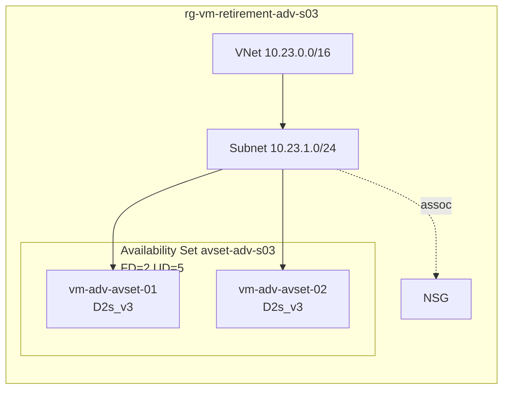

# ADV-S03 · Availability Set

> **Pattern**: an Availability Set with two VMs. Demonstrates that single-VM
> resize within an AvSet works in modern regions, but documents the
> conservative `deallocate-all → resize-all → start-all` runbook recommended
> for production.

## What this scenario proves

- Single-VM resize within an AvSet is **possible** today (the historical
  restriction has been relaxed).
- The conservative AvSet-wide runbook always works and is the recommended
  default for change windows.
- AvSet anchoring metadata is preserved across the operation.

## Architecture



Recommended conservative flow:


## Files

`main.tf`, `variables.tf`, `terraform.tfvars.example`.

## Deploy

```powershell
Copy-Item terraform.tfvars.example terraform.tfvars
notepad terraform.tfvars

terraform init
terraform apply -auto-approve
```

## Procedure (conservative — recommended)

```bash
RG=rg-vm-retirement-adv-s03
TARGET=Standard_D2s_v5

# 1. Deallocate ALL VMs in the set
for VM in vm-adv-avset-01 vm-adv-avset-02; do
  az vm deallocate -g $RG -n $VM
done

# 2. Resize ALL VMs
for VM in vm-adv-avset-01 vm-adv-avset-02; do
  az vm update -g $RG -n $VM --set hardwareProfile.vmSize=$TARGET
done

# 3. Start ALL VMs
for VM in vm-adv-avset-01 vm-adv-avset-02; do
  az vm start -g $RG -n $VM
done

# 4. Validate
for VM in vm-adv-avset-01 vm-adv-avset-02; do
  az vm run-command invoke -g $RG -n $VM --command-id RunShellScript \
    --scripts 'uname -a; grep "model name" /proc/cpuinfo | head -1; uptime'
done
```

## Procedure (fast path — single VM at a time)

Only use this if you can tolerate a temporary asymmetry inside the AvSet.

```bash
az vm deallocate -g $RG -n vm-adv-avset-01
az vm update     -g $RG -n vm-adv-avset-01 --set hardwareProfile.vmSize=$TARGET
az vm start      -g $RG -n vm-adv-avset-01
# validate
# then repeat for vm-adv-avset-02
```

## Expected outcome

- Both VMs land on the new SKU.
- `az vm show ... --query availabilitySet.id` still references the AvSet on
  both VMs.
- New CPU model reflects the target family.

## Teardown

```powershell
terraform destroy -auto-approve
```

## References

- Background article: [OPERATIONAL-GUIDE.md](../../OPERATIONAL-GUIDE.md) — full master technical guide and L1 runbook for this lab.
- Microsoft: [Availability Sets overview](https://learn.microsoft.com/azure/virtual-machines/availability-set-overview)
- Microsoft: [`resize-vm`](https://learn.microsoft.com/azure/virtual-machines/sizes/resize-vm)
- Guide: [OPERATIONAL-GUIDE.md › Phase 3](../../OPERATIONAL-GUIDE.md#phase-2--execute-the-resize)
