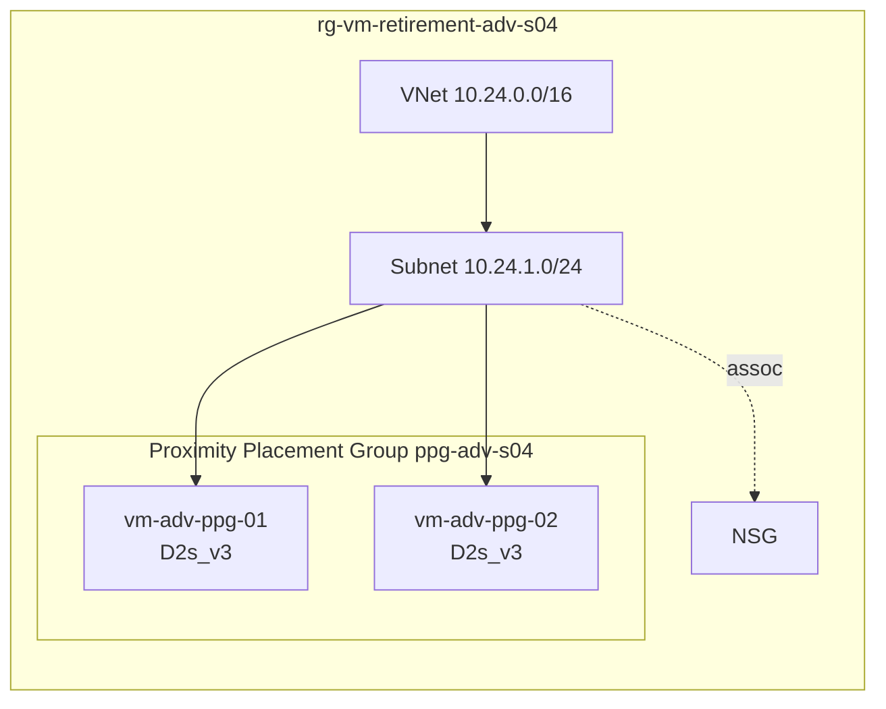

# ADV-S04 · Proximity Placement Group

> **Pattern**: a Proximity Placement Group with two VMs. Demonstrates that
> one-by-one resize within a PPG works in modern regions and that the PPG
> re-anchors to the new SKU's cluster on the first resize.

## What this scenario proves

- One-by-one PPG resize works without dissolving the group.
- After both VMs are resized, the PPG is anchored to the cluster that hosts
  the new SKU.
- The deterministic `deallocate-all → resize-all → start-all` runbook is also
  valid and is the recommended default for change windows.

## Architecture



## Files

`main.tf`, `variables.tf`, `terraform.tfvars.example`.

## Deploy

```powershell
Copy-Item terraform.tfvars.example terraform.tfvars
notepad terraform.tfvars

terraform init
terraform apply -auto-approve
```

## Procedure (deterministic — recommended)

```bash
RG=rg-vm-retirement-adv-s04
TARGET=Standard_D2s_v5

# 1. Deallocate both
az vm deallocate -g $RG -n vm-adv-ppg-01
az vm deallocate -g $RG -n vm-adv-ppg-02

# 2. Resize both
az vm update -g $RG -n vm-adv-ppg-01 --set hardwareProfile.vmSize=$TARGET
az vm update -g $RG -n vm-adv-ppg-02 --set hardwareProfile.vmSize=$TARGET

# 3. Start both
az vm start -g $RG -n vm-adv-ppg-01
az vm start -g $RG -n vm-adv-ppg-02

# 4. Validate PPG association
az vm show -g $RG -n vm-adv-ppg-01 --query proximityPlacementGroup.id
az vm show -g $RG -n vm-adv-ppg-02 --query proximityPlacementGroup.id
```

## Procedure (one-by-one — fast path)

```bash
az vm deallocate -g $RG -n vm-adv-ppg-01
az vm update     -g $RG -n vm-adv-ppg-01 --set hardwareProfile.vmSize=$TARGET
az vm start      -g $RG -n vm-adv-ppg-01
# validate, then repeat for vm-adv-ppg-02
```

## Expected outcome

- Both VMs land on the target SKU.
- Both VMs still reference the PPG.
- The new CPU model reflects the target family on both VMs.

## Teardown

```powershell
terraform destroy -auto-approve
```

## References

- Background article: [OPERATIONAL-GUIDE.md](../../OPERATIONAL-GUIDE.md) — full master technical guide and L1 runbook for this lab.
- Microsoft: [Proximity Placement Groups](https://learn.microsoft.com/azure/virtual-machines/co-location)
- Microsoft: [`resize-vm`](https://learn.microsoft.com/azure/virtual-machines/sizes/resize-vm)
- Guide: [OPERATIONAL-GUIDE.md › Phase 3](../../OPERATIONAL-GUIDE.md#phase-2--execute-the-resize)
