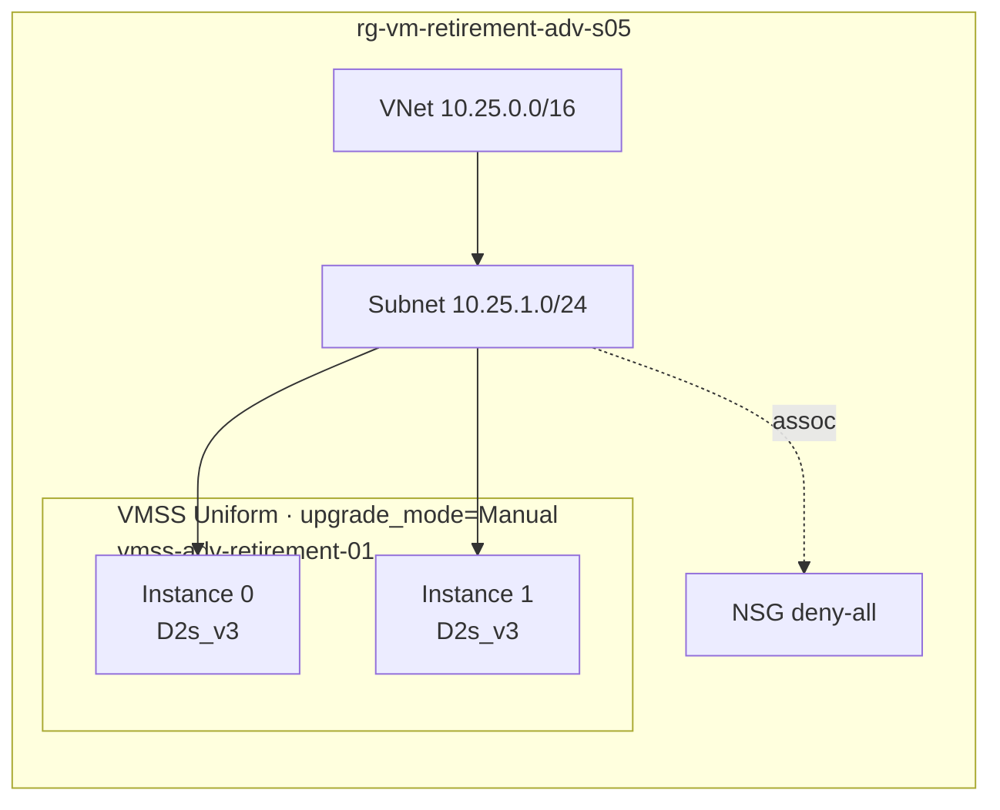
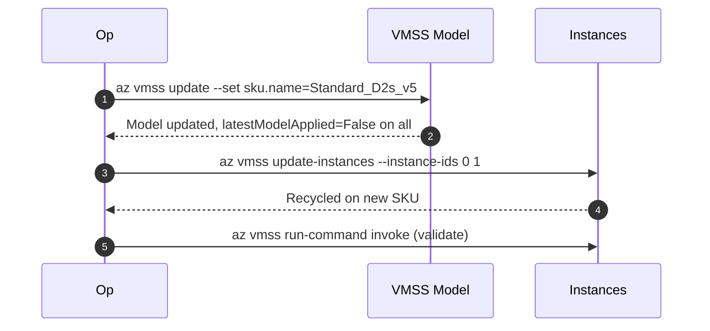

# ADV-S05 · Virtual Machine Scale Set (Uniform · Manual)

> **Pattern**: a VMSS Uniform with `upgrade_mode=Manual`. Demonstrates the
> two-step VMSS resize: change the model SKU, then explicitly call
> `update-instances` to recycle the instances on the new model.

## What this scenario proves

- Changing `sku.name` on a VMSS in `Manual` mode updates the **model** only —
  running instances stay on the old SKU and `latestModelApplied=False`.
- `az vmss update-instances --instance-ids …` recycles selected instances onto
  the new model, with full control over the batch size.
- The `Rolling` and `Automatic` modes behave differently — see the
  [OPERATIONAL-GUIDE.md › VMSS mini-runbook](../../OPERATIONAL-GUIDE.md#vmss-mini-runbook).

## Architecture



Two-step flow:



## Files

`main.tf`, `variables.tf`, `terraform.tfvars.example`.

## Deploy

```powershell
Copy-Item terraform.tfvars.example terraform.tfvars
notepad terraform.tfvars

terraform init
terraform apply -auto-approve
```

## Procedure

```bash
RG=rg-vm-retirement-adv-s05
SS=vmss-adv-retirement-01
TARGET=Standard_D2s_v5

# 1. Baseline
az vmss show -g $RG -n $SS --query "{sku:sku.name, mode:upgradePolicy.mode}"
az vmss list-instances -g $RG -n $SS --query "[].{id:instanceId, model:latestModelApplied, sku:sku.name}" -o table

# 2. Stage the new SKU on the model (does not touch instances)
az vmss update -g $RG -n $SS --set sku.name=$TARGET

# 3. Inspect drift: latestModelApplied=False on every instance
az vmss list-instances -g $RG -n $SS --query "[].{id:instanceId, model:latestModelApplied}" -o table

# 4. Recycle instances (here: all of them; in production split into batches)
az vmss list-instances -g $RG -n $SS --query "[].instanceId" -o tsv \
  | xargs az vmss update-instances -g $RG -n $SS --instance-ids

# 5. Validate
az vmss list-instances -g $RG -n $SS --query "[].{id:instanceId, model:latestModelApplied}" -o table
az vmss run-command invoke -g $RG -n $SS --instance-id 0 \
  --command-id RunShellScript --scripts 'uname -a; grep "model name" /proc/cpuinfo | head -1'
```

## Expected outcome

- After step 2: model SKU = `Standard_D2s_v5`; instances still on the old SKU
  but flagged `latestModelApplied=False`.
- After step 4: instances recycled on the new SKU; `latestModelApplied=True`.
- CPU model reflects the new family on each instance.

## Teardown

```powershell
terraform destroy -auto-approve
```

## References

- Background article: [docs/project-overview.md](../../docs/project-overview.md) — the source technical guide that motivated this lab.
- Microsoft: [VMSS upgrade modes](https://learn.microsoft.com/azure/virtual-machine-scale-sets/virtual-machine-scale-sets-upgrade-policy)
- Microsoft: [`az vmss update-instances`](https://learn.microsoft.com/cli/azure/vmss#az-vmss-update-instances)
- Guide: [OPERATIONAL-GUIDE.md › VMSS mini-runbook](../../OPERATIONAL-GUIDE.md#vmss-mini-runbook)
