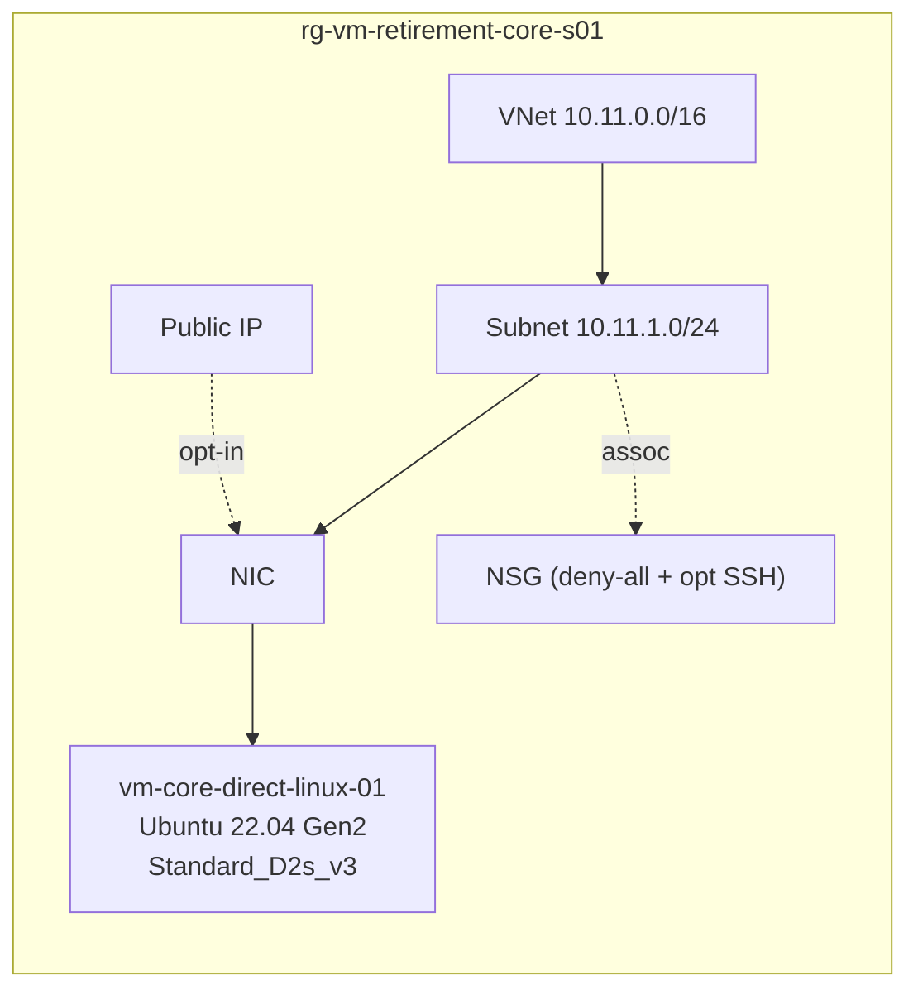

# CORE-S01 · Direct Linux resize (happy path)

> **Pattern**: in-place resize within the SCSI family — `Standard_D2s_v3` →
> `Standard_D2s_v5`. The simplest possible case, used as the baseline for the
> other scenarios.

## What this scenario proves

- A SKU change within the v3 → v5 SCSI line is a single `az vm update` call.
- No reboot of the storage path, no controller change.
- Useful baseline for timing, naming and tag inheritance after a resize.

## Architecture



## Files

| File | Purpose |
|---|---|
| `main.tf` | RG, VNet, Subnet, NSG, NIC, PIP, Linux VM. |
| `variables.tf` | `location`, `delete_after`, `allowed_source_ip`, `admin_username`, `linux_admin_password`, `admin_ssh_public_key_path`, `enable_public_ips`. |
| `terraform.tfvars.example` | Placeholder values — copy to `terraform.tfvars` and edit. |

## Deploy

```powershell
Copy-Item terraform.tfvars.example terraform.tfvars
notepad terraform.tfvars   # set a strong password and your allowed_source_ip

terraform init
terraform apply -auto-approve
```

## Procedure — the resize itself

```bash
RG=rg-vm-retirement-core-s01
VM=vm-core-direct-linux-01

# 1. Capture the starting CPU model (baseline)
az vm run-command invoke -g $RG -n $VM --command-id RunShellScript \
  --scripts "grep 'model name' /proc/cpuinfo | head -1"

# 2. Deallocate
az vm deallocate -g $RG -n $VM

# 3. Resize
az vm update -g $RG -n $VM --set hardwareProfile.vmSize=Standard_D2s_v5

# 4. Start
az vm start -g $RG -n $VM

# 5. Validate the new CPU model
az vm run-command invoke -g $RG -n $VM --command-id RunShellScript \
  --scripts "uname -a; grep 'model name' /proc/cpuinfo | head -1; uptime"
```

## Expected outcome

- The `az vm update` returns in seconds.
- After `az vm start`, the VM is up on the new SKU within ~1 minute.
- The CPU `model name` reflects the new family (commonly Intel Sapphire Rapids
  `8473C` or similar for `D{x}s_v5` in modern regions).
- The same public IP, NIC and disks are preserved.

## Teardown

```powershell
terraform destroy -auto-approve
```

## References

- Background article: [docs/project-overview.md](../../docs/project-overview.md) — the source technical guide that motivated this lab.
- Main guide: [OPERATIONAL-GUIDE.md › Phase 3 — Execute](../../OPERATIONAL-GUIDE.md#phase-3--execute-destructive--operates-inside-the-change-window).
- Cross-scenario finding #1 in the [root README](../../README.md#cross-scenario-findings).
