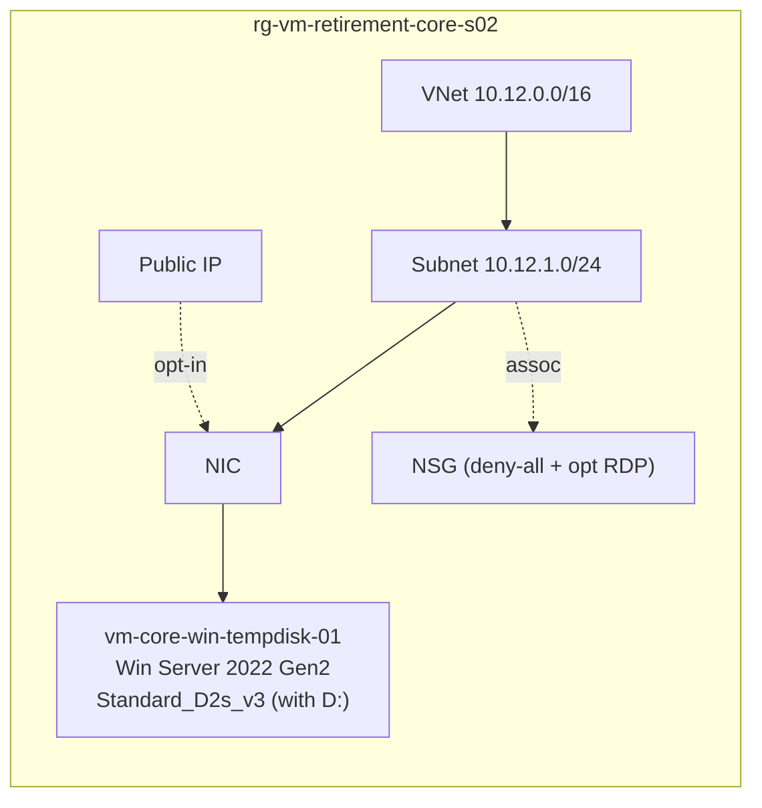
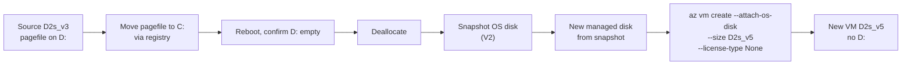

# CORE-S02 · Windows with pagefile on the temp disk

> **Pattern**: Windows VM whose `pagefile.sys` lives on `D:` (the temp disk).
> A direct resize to a SKU without temp disk is **not supported**. This scenario
> reproduces the official workaround: move pagefile → snapshot → create the new
> VM with `az vm create --attach-os-disk`.

## What this scenario proves

- The Windows OS-level constraint: cannot in-place resize across the temp-disk
  boundary.
- The supported workaround (snapshot + new VM) preserves the OS disk and data.
- After `--attach-os-disk`, the AHB / `licenseType` flag must be passed again
  explicitly if it was set on the source.

## Architecture



Migration flow:



## Files

`main.tf`, `variables.tf`, `terraform.tfvars.example`.

## Deploy

```powershell
Copy-Item terraform.tfvars.example terraform.tfvars
notepad terraform.tfvars

terraform init
terraform apply -auto-approve
```

## Procedure

```powershell
$RG  = "rg-vm-retirement-core-s02"
$VM  = "vm-core-win-tempdisk-01"
$NEW = "vm-core-win-tempdisk-02"

# 1. Move pagefile from D: to C: via registry
$script = @'
Set-ItemProperty -Path "HKLM:\SYSTEM\CurrentControlSet\Control\Session Manager\Memory Management" `
  -Name "PagingFiles" -Value "C:\pagefile.sys 0 0"
Write-Output "Pagefile moved to C: (reboot required)"
'@
az vm run-command invoke -g $RG -n $VM --command-id RunPowerShellScript --scripts $script

# 2. Reboot
az vm restart -g $RG -n $VM

# 3. Deallocate
az vm deallocate -g $RG -n $VM

# 4. Snapshot OS disk
$osDisk = az vm show -g $RG -n $VM --query "storageProfile.osDisk.name" -o tsv
$osDiskId = az disk show -g $RG -n $osDisk --query id -o tsv
az snapshot create -g $RG -n "snap-$VM-pre-resize" --source $osDiskId

# 5. Create new managed disk from snapshot (V2 size)
$snapId = az snapshot show -g $RG -n "snap-$VM-pre-resize" --query id -o tsv
az disk create -g $RG -n "$NEW-osdisk" --source $snapId --sku Premium_LRS

# 6. Create a NIC for the new VM on the existing subnet (Terraform only created
#    the NIC for the source VM). Reuse the same VNet/subnet/NSG.
$VNET   = "vnet-core-s02"
$SUBNET = "subnet-vms"
$subId  = az network vnet subnet show -g $RG --vnet-name $VNET -n $SUBNET --query id -o tsv
az network nic create -g $RG -n "nic-$NEW" --subnet $subId

# 7. Create new VM attached to the existing OS disk
$newDiskId = az disk show -g $RG -n "$NEW-osdisk" --query id -o tsv
az vm create -g $RG -n $NEW `
  --attach-os-disk $newDiskId `
  --os-type Windows `
  --size Standard_D2s_v5 `
  --license-type None `
  --nics "nic-$NEW" `
  --public-ip-address ""

# 8. Validate
az vm run-command invoke -g $RG -n $NEW --command-id RunPowerShellScript `
  --scripts "Get-CimInstance Win32_OperatingSystem | Select-Object Caption, Version; Get-Volume"
```

> ⚠️ **Critical**: do **not** pass `--admin-username` / `--admin-password` to
> `az vm create --attach-os-disk` — the OS disk already has its credentials. Do
> pass `--license-type Windows_Server` if the source VM had AHB.

## Expected outcome

- The new VM boots without `D:` drive.
- No `pagefile.sys` errors in the event log.
- Same OS disk, same data, new SKU.

## Recovery — Terraform state divergence

This workflow recreates the VM outside Terraform's view. To return to a clean
slate:

```powershell
az group delete -g rg-vm-retirement-core-s02 --yes --no-wait
Remove-Item terraform.tfstate*, .terraform.lock.hcl -Force
Remove-Item .terraform -Recurse -Force
```

## References

- Background article: [OPERATIONAL-GUIDE.md](../../OPERATIONAL-GUIDE.md) — full master technical guide and L1 runbook for this lab.
- Microsoft: [`change-drive-letter`](https://learn.microsoft.com/azure/virtual-machines/windows/change-drive-letter)
- Microsoft: [`azure-vms-no-temp-disk`](https://learn.microsoft.com/azure/virtual-machines/azure-vms-no-temp-disk)
- Guide: [OPERATIONAL-GUIDE.md › Temp disk](../../OPERATIONAL-GUIDE.md#temp-disk-does-the-target-have-one-or-not)

---

## Cross-links

- [Volver al catálogo de escenarios](../../README.md#scenario-catalog)
- [Guía operacional y técnica](../../OPERATIONAL-GUIDE.md)
- Escenarios relacionados:
  - [CORE-S01 · Linux resize directo](../s01-direct-resize-linux/README.md)
  - [CORE-S03 · Linux con temp disk](../s03-linux-tempdisk/README.md)
  - [CORE-S04 · Azure Hybrid Benefit](../s04-ahb-windows/README.md)
