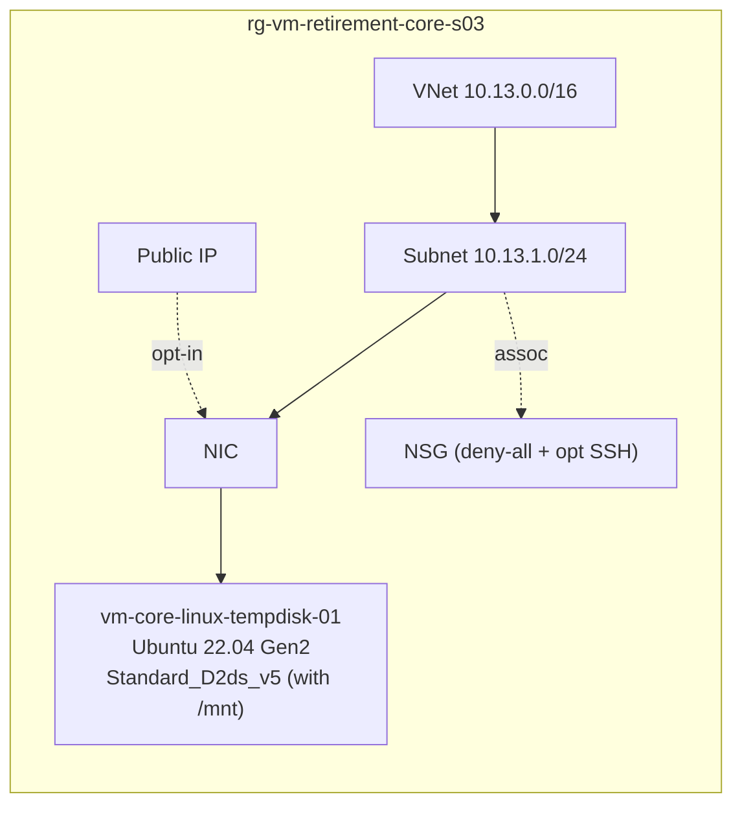

# CORE-S03 · Linux with temp disk (`/mnt`)

> **Pattern**: counterpart to CORE-S02 for Linux. Demonstrates why the same
> migration is **usually** simpler on Ubuntu: default cloud-init does not
> enable swap on `/mnt` and `fstab` uses `nofail`. A direct resize across the
> temp-disk boundary works without preparation.

## What this scenario proves

- Default Ubuntu 22.04 cloud-init leaves `/mnt` unused
  (`ResourceDisk.EnableSwap=n`).
- A direct resize from a "d" SKU to a non-"d" SKU works as long as nothing
  active uses `/mnt`.
- How to detect and handle the **opposite** case (swap explicitly enabled on
  `/mnt` by an operator).

## Architecture



## Files

`main.tf`, `variables.tf`, `terraform.tfvars.example`.

## Deploy

```powershell
Copy-Item terraform.tfvars.example terraform.tfvars
notepad terraform.tfvars

terraform init
terraform apply -auto-approve
```

## Procedure

```bash
RG=rg-vm-retirement-core-s03
VM=vm-core-linux-tempdisk-01

# 1. Confirm /mnt is not in use (Ubuntu default)
az vm run-command invoke -g $RG -n $VM --command-id RunShellScript \
  --scripts 'swapon --show; lsblk -o NAME,SIZE,MOUNTPOINT; grep mnt /etc/fstab'

# Expected: empty swap, /mnt with nofail in fstab

# 2. Deallocate + resize across the boundary
az vm deallocate -g $RG -n $VM
az vm update     -g $RG -n $VM --set hardwareProfile.vmSize=Standard_D2s_v5
az vm start      -g $RG -n $VM

# 3. Validate
az vm run-command invoke -g $RG -n $VM --command-id RunShellScript \
  --scripts 'uname -a; lsblk -o NAME,SIZE,MOUNTPOINT; df -h /'
```

## What if swap IS active on `/mnt`?

If an operator created a swap file on `/mnt/swapfile`, the resize across the
boundary will fail or boot in a degraded state. Preparation:

```bash
az vm run-command invoke -g $RG -n $VM --command-id RunShellScript --scripts '
  set -e
  swapoff /mnt/swapfile || true
  rm -f /mnt/swapfile
  sed -i "/\/mnt\/swapfile/d" /etc/fstab
  # Optional: create swap on OS disk instead
  fallocate -l 2G /swapfile && chmod 600 /swapfile && mkswap /swapfile && swapon /swapfile
  echo "/swapfile none swap sw 0 0" >> /etc/fstab
'
```

Then run the resize as above.

## Expected outcome

- Resize succeeds in seconds (deallocate + update + start).
- New CPU model reflects the target family.
- `/mnt` simply disappears from `lsblk` on the diskless SKU — no error because
  fstab uses `nofail`.

## Teardown

```powershell
terraform destroy -auto-approve
```

## References

- Microsoft: [`azure-vms-no-temp-disk`](https://learn.microsoft.com/azure/virtual-machines/azure-vms-no-temp-disk)
- Microsoft: [`waagent.conf` reference (`ResourceDisk.EnableSwap`)](https://learn.microsoft.com/azure/virtual-machines/extensions/agent-linux)
- Guide: [OPERATIONAL-GUIDE.md › Temp disk](../../OPERATIONAL-GUIDE.md#1-temp-disk-present-or-absent)
