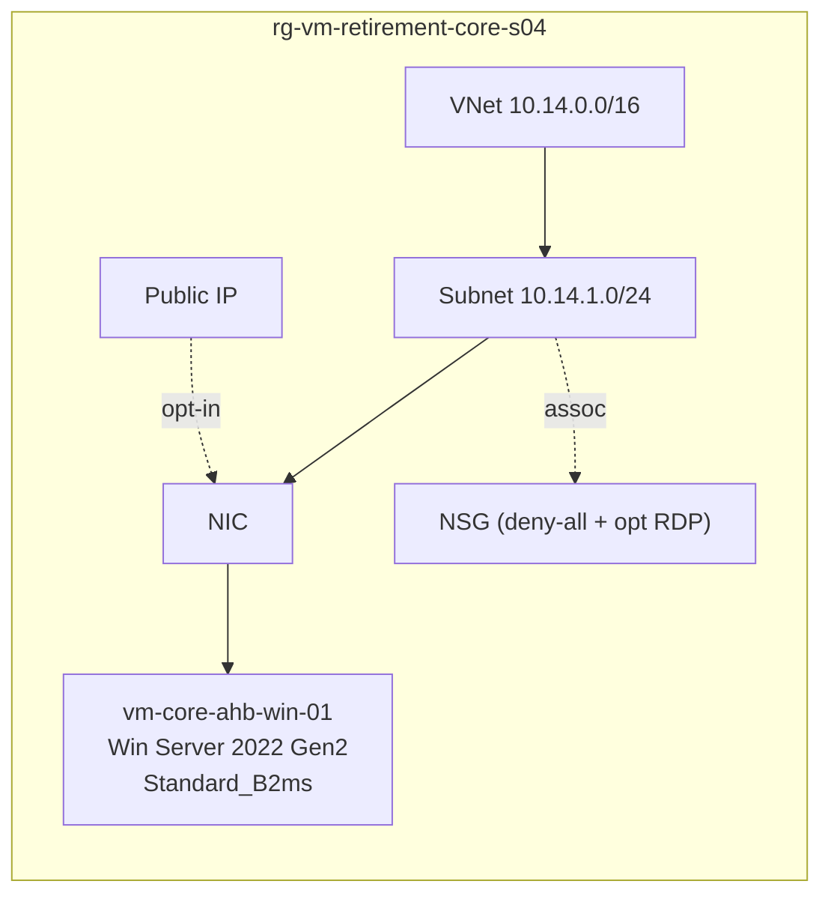
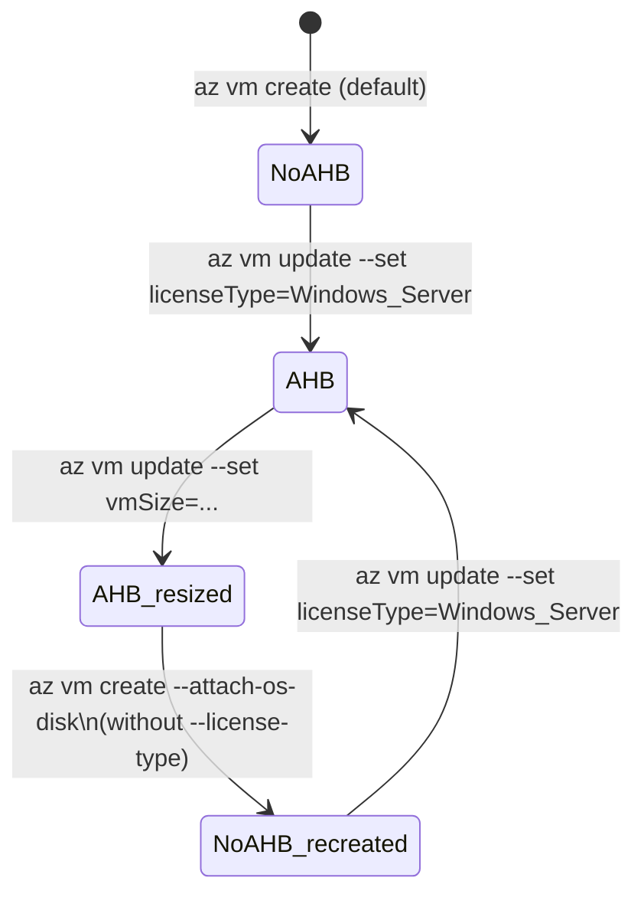

# CORE-S04 · Azure Hybrid Benefit (Windows) lifecycle

> **Pattern**: full AHB lifecycle on a Windows Server VM — activate, resize
> across families, prove that AHB persists, and verify the recreate caveat.

## What this scenario proves

- Activating AHB (`licenseType=Windows_Server`) is a metadata flip — no reboot,
  no downtime.
- AHB **survives** a cross-family resize (e.g. `B2ms` → `D2s_v3`).
- AHB is **lost** after `az vm create --attach-os-disk` unless you pass
  `--license-type Windows_Server` explicitly.
- The minimum is 8 core licenses per VM regardless of vCPU count below 8.

## Architecture



AHB state machine:



## Files

`main.tf`, `variables.tf`, `terraform.tfvars.example`.

## Deploy

```powershell
Copy-Item terraform.tfvars.example terraform.tfvars
notepad terraform.tfvars

terraform init
terraform apply -auto-approve
```

## Procedure

```powershell
$RG = "rg-vm-retirement-core-s04"
$VM = "vm-core-ahb-win-01"

# 1. Initial state: licenseType should be null
az vm show -g $RG -n $VM --query licenseType

# 2. Activate AHB
az vm update -g $RG -n $VM --set licenseType=Windows_Server

# 3. Verify
az vm show -g $RG -n $VM --query licenseType
# → "Windows_Server"

# 4. Resize cross-family (B2ms → D2s_v3)
az vm deallocate -g $RG -n $VM
az vm update     -g $RG -n $VM --set hardwareProfile.vmSize=Standard_D2s_v3
az vm start      -g $RG -n $VM

# 5. Verify AHB persisted
az vm show -g $RG -n $VM --query licenseType
# → "Windows_Server" (unchanged)

# 6. To go from Dsv3 → Dsv5 (no temp disk): follow CORE-S02 pattern.
#    When you run `az vm create --attach-os-disk`, pass --license-type explicitly:
#
#    az vm create ... --attach-os-disk <id> --license-type Windows_Server
```

## Expected outcome

- AHB visible as `Windows_Server` in `az vm show`.
- No service interruption during the AHB activation step.
- Billing reflects AHB on the next invoice cycle (verify in Cost Management).

## Teardown

```powershell
terraform destroy -auto-approve
```

## References

- Background article: [OPERATIONAL-GUIDE.md](../../OPERATIONAL-GUIDE.md) — full master technical guide and L1 runbook for this lab.
- Microsoft: [`hybrid-use-benefit-licensing`](https://learn.microsoft.com/azure/virtual-machines/windows/hybrid-use-benefit-licensing)
- Guide: [OPERATIONAL-GUIDE.md › Windows licensing](../../OPERATIONAL-GUIDE.md#windows-licensing-when-leaving-b-series-compute-cost-and-ahb)

---

## Cross-links

- [Volver al catálogo de escenarios](../../README.md#scenario-catalog)
- [Guía operacional y técnica](../../OPERATIONAL-GUIDE.md)
- Escenarios relacionados:
  - [CORE-S02 · Windows con temp disk](../s02-windows-tempdisk/README.md)
