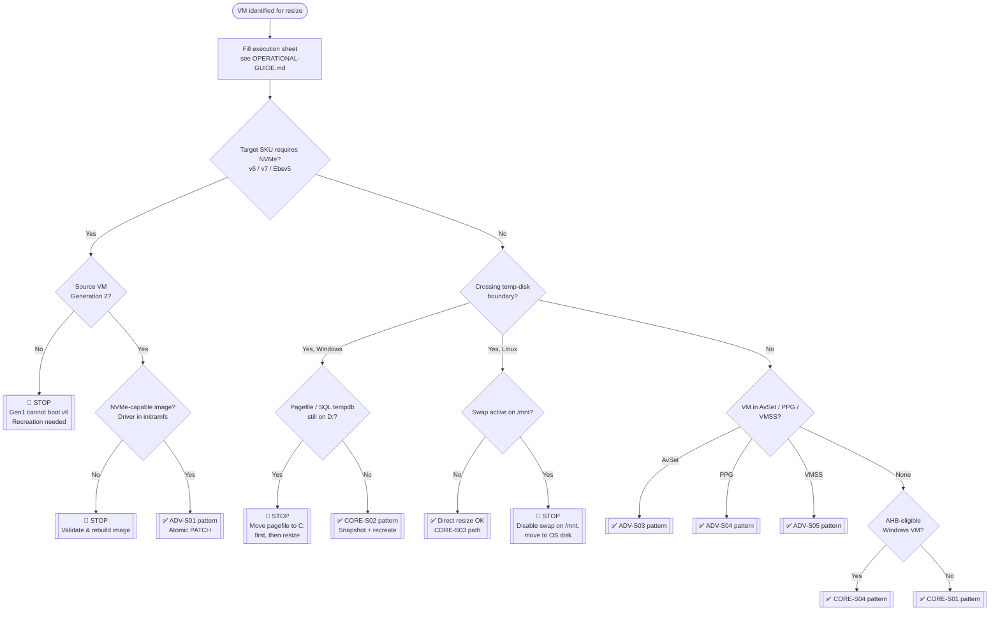
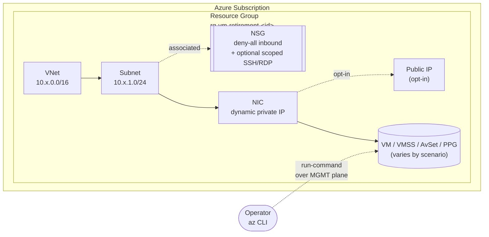
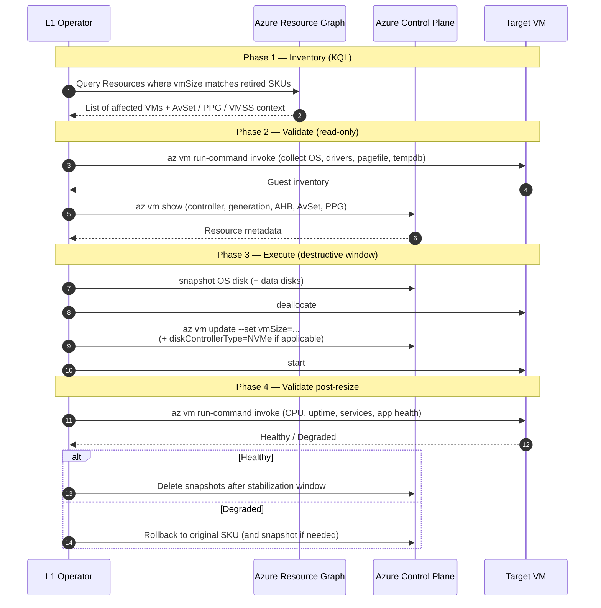
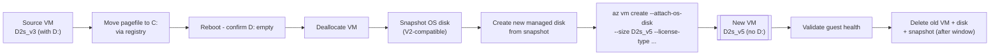
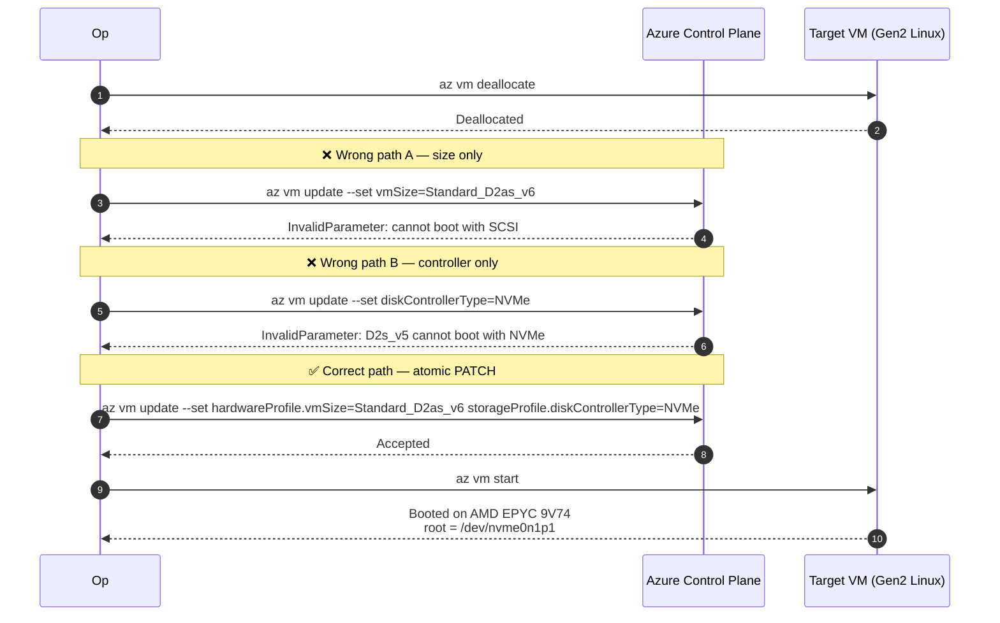
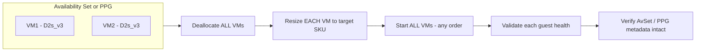
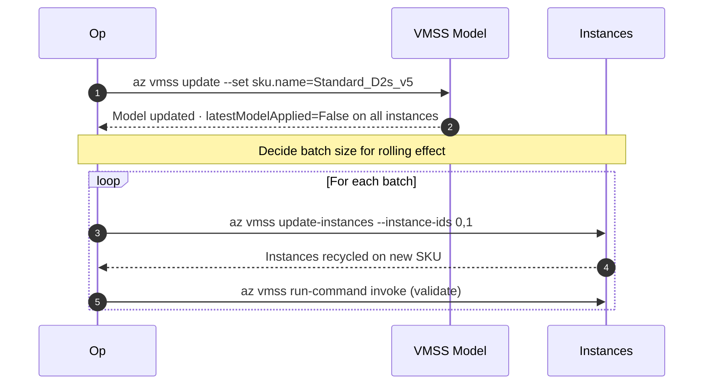
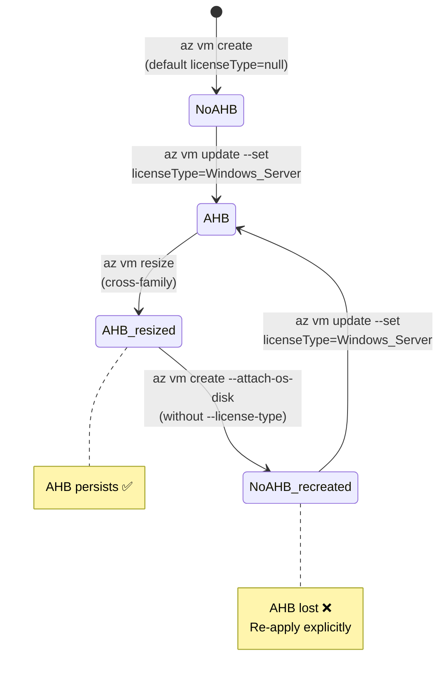

# Diagrams

This document collects every diagram referenced from the [main
README](../README.md), the [operational guide](../OPERATIONAL-GUIDE.md) and the
nine scenario READMEs. All diagrams are written in Mermaid so they render
natively on GitHub and in most Markdown previewers.

---

## 1. Macro decision tree

The decision tree the L1 operator runs **before** touching any VM.

---

## 2. Standard lab topology

Every scenario shares the same minimal blueprint:

---

## 3. L1 runbook phases

The runbook has four phases. Phases 1 and 2 are read-only and idempotent.

---

## 4. CORE-S02 — Windows pagefile on temp disk

When the source has a temp disk and the target does not, an in-place resize is
not allowed for Windows. This is the supported workaround:

---

## 5. ADV-S01 — Atomic SCSI → NVMe PATCH

The only command shape that works to move a Dsv5 VM to a v6 NVMe SKU in place:

---

## 6. ADV-S03 / ADV-S04 — AvSet & PPG conservative runbook

Single-VM resize within an AvSet / PPG works in modern regions, but the supported
runbook is the conservative one:

---

## 7. ADV-S05 — VMSS Manual upgrade

The two-step VMSS resize:

---

## 8. AHB lifecycle (CORE-S04)

Azure Hybrid Benefit survives a resize but **does not** survive a recreate:

