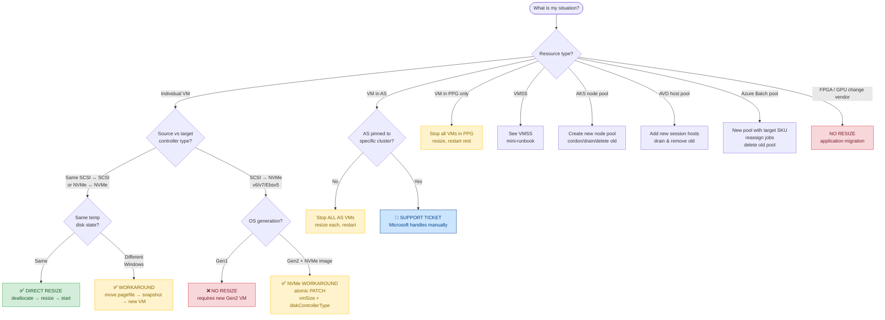

# Retired Azure VM size series — Technical guide & operational resize runbook

> **Temp disk, SCSI/NVMe controller, Windows licensing and Azure-SSIS IR — everything you need to know before moving a single VM.**

This document is the **source article** that motivated and shaped this lab. It is split into two parts:

1. **Technical article** — context, retirement dates, replacement families and the four operational traps that break "simple" resizes.
2. **Operational production runbook** — the executable procedure, hand-off ready for L1/L2 operations teams.

The scenarios under [`core-vms/`](../core-vms) and [`advanced-vms/`](../advanced-vms) are the **lab-verified reproductions** of every situation discussed below. The companion document [OPERATIONAL-GUIDE.md](../OPERATIONAL-GUIDE.md) is the curated, production-grade version of Part 2.

---

## Table of contents

- [Part 1 — Technical article](#part-1--technical-article)
  - [Why Microsoft retires VM series](#why-microsoft-retires-vm-series--and-what-that-means-for-you)
  - [Affected series and official replacements](#affected-series-and-their-official-replacements)
  - [Migration guides by family](#migration-guides-by-family-the-operational-essentials)
  - [Critical operational considerations](#critical-operational-considerations)
    - [Temp disk](#temp-disk-does-the-target-have-one-or-not)
    - [SCSI vs NVMe controller](#scsi-vs-nvme-controller-the-invisible-trap-when-migrating-to-v6-or-v7)
    - [Windows licensing & AHB](#windows-licensing-when-leaving-b-series-compute-cost-and-ahb)
    - [Azure-SSIS Integration Runtime](#azure-ssis-integration-runtime-and-the-dv2av2-family-retirement)
- [Part 2 — Operational production runbook](#part-2--operational-production-runbook)
  - [Glossary](#glossary-and-abbreviations)
  - [Decision tree](#decision-tree-what-type-of-resize-do-i-have)
  - [VM execution card](#vm-execution-card-fill-in-before-operating)
  - [Stop conditions](#stop-conditions-conditions-that-block-execution)
  - [Step-by-step operational guide](#step-by-step-operational-guide-for-the-resize)
  - [VMSS mini-runbook](#mini-runbook-virtual-machine-scale-sets-vmss)
  - [Closeout checklist](#actionable-checklist-closing-the-operation)
- [Official sources consulted](#official-sources-consulted)

---

# Part 1 — Technical article

## Why Microsoft retires VM series — and what that means for you

Over the past twelve months Microsoft published an unusually high number of retirement announcements for virtual machine series. It's not coincidence: the hardware running those families has reached end of life, processor vendors no longer offer extended support, and the performance-per-euro gap compared to current generations has become hard to justify.

The practical consequence is straightforward: **the day a series enters `Retired` status, existing VMs get deallocated, stop running, lose their SLA and stop billing — but managed disk data is preserved.** If you don't act before the deadline, your workloads go dark without warning.

This article addresses a specific question we hear regularly from customers and partners: **how do I resize safely?** The answer isn't trivial. There are at least four traps that can break an apparently simple migration:

1. The presence (or absence) of a temp disk.
2. The disk controller change from SCSI to NVMe in v6+ families.
3. The Windows licensing cost increase when leaving B-series.
4. The impact on Azure Data Factory Azure-SSIS Integration Runtimes.

### Key retirement dates

| Series                                     | Retirement date |
| ------------------------------------------ | --------------- |
| `D`, `Ds`, `Dv2`, `Dsv2`, `Ls`             | 2028-05-01      |
| `Av2`, `Amv2`, `Bv1`, `F`, `Fs`, `Fsv2`, `G`, `Gs`, `Lsv2` | 2028-11-15 |
| `NVv3`, `NVv4`                             | 2026-09-30      |
| `NP`, `HBv2`                               | 2027-05-31      |
| `M192` SKUs (`Msv2` / `Mdsv2`)             | 2027-03-31      |

> **Source:** [Retired sizes list](https://learn.microsoft.com/en-us/azure/virtual-machines/sizes/retirement/retired-sizes-list)

---

## Affected series and their official replacements

The table below consolidates all information published by Microsoft on the official retired sizes page and each family's migration guide.

- **Announced** — the series is still available but has a cutoff date.
- **Retired** — it can no longer be provisioned.

| Series           | Status    | Retirement date | Primary replacement family                  | Migration guide |
| ---------------- | --------- | --------------- | ------------------------------------------- | --------------- |
| `D-series`       | Announced | 2028-05-01      | `Dsv5` / `Ddsv5` / `Dasv5` / `Dsv6`         | [d-ds-dv2-dsv2-ls](https://learn.microsoft.com/en-us/azure/virtual-machines/migration/sizes/d-ds-dv2-dsv2-ls-series-migration-guide) |
| `Ds-series`      | Announced | 2028-05-01      | `Dsv5` / `Ddsv5` / `Dasv5` / `Dsv6`         | idem |
| `Dv2-series`     | Announced | 2028-05-01      | `Dsv5` / `Ddsv5` / `Dasv5` / `Dsv6`         | idem |
| `Dsv2-series`    | Announced | 2028-05-01      | `Dsv5` / `Ddsv5` / `Dasv5` / `Dsv6`         | idem |
| `Av2` / `Amv2`   | Announced | 2028-11-15      | `Bsv2` / `Basv2` / `Dsv5` / `Esv5`          | idem |
| `B-series V1`    | Announced | 2028-11-15      | `Bsv2` / `Basv2` / `Dlsv5` / `Dlsv6`        | idem |
| `F-series`       | Announced | 2028-11-15      | `Dlsv6` / `Dldsv6` / `Dalsv6`               | idem |
| `Fs-series`      | Announced | 2028-11-15      | `Dlsv6` / `Dldsv6` / `Dalsv6`               | idem |
| `Fsv2-series`    | Announced | 2028-11-15      | `Dldsv5` / `Dlsv5` / `Dsv5` / `Ddsv5`       | idem |
| `G-series`       | Announced | 2028-11-15      | `Lsv3` / `Lasv3` / `Lsv4` / `Lasv4`         | idem |
| `Gs-series`      | Announced | 2028-11-15      | `Lsv3` / `Lasv3` / `Lsv4` / `Lasv4`         | idem |
| `Msv2` / `Mdsv2` M192 | Announced | 2027-03-31 | `Msv3` / `Mdsv3` Medium Memory            | [msv2-mdsv2-retirement](https://learn.microsoft.com/en-us/azure/virtual-machines/sizes/retirement/msv2-mdsv2-retirement) |
| `Ls-series`      | Announced | 2028-05-01      | `Lsv3` / `Lasv3` / `Lsv4` / `Lasv4`         | idem |
| `Lsv2-series`    | Announced | 2028-11-15      | `Lsv3` / `Lasv3` / `Lasv4`                  | idem |
| `HBv2-series`    | Announced | 2027-05-31      | `HBv5` / `HX` / `HBv4` / `HBv3`             | idem |
| `HC-series`      | Announced | 2027-05-31      | `HBv5` / `HX`                               | [hc-series-retirement](https://learn.microsoft.com/en-us/azure/virtual-machines/sizes/retirement/hc-series-retirement) |
| `NVv3-series`    | Announced | 2026-09-30      | `NVadsA10_v5` / `NCasT4_v3`                 | [nvv3-series-retirement](https://learn.microsoft.com/en-us/azure/virtual-machines/sizes/gpu-accelerated/nvv3-series-retirement) |
| `NVv4-series`    | Announced | 2026-09-30      | `NVads_V710_v5`                             | [nvv4-retirement](https://learn.microsoft.com/en-us/azure/virtual-machines/sizes/gpu-accelerated/nvv4-retirement) |
| `NCv3` / `NC24rs`| **Retired** | 2025-09-30    | See retirement guide                        | learn.microsoft.com — ncv3-retirement |
| `NP-series`      | Announced | 2027-05-31      | `NDv2` / `NCads_H100_v5` / `NCasT4_v3`      | [np-series-retirement](https://learn.microsoft.com/en-us/azure/virtual-machines/sizes/retirement/np-series-retirement) |

> **Note:** `idem` indicates the series is covered by the unified guide at [d-ds-dv2-dsv2-ls-series-migration-guide](https://learn.microsoft.com/en-us/azure/virtual-machines/migration/sizes/d-ds-dv2-dsv2-ls-series-migration-guide), which also includes `HBv2` in a dedicated section.

---

## Migration guides by family: the operational essentials

Microsoft has published specific migration guides for each series group. Below we summarize the most relevant operational points, based exclusively on official documentation.

### `D`, `Ds`, `Dv2`, `Dsv2`, `Av2`, `Amv2`, `Bv1`, `F`, `Fs`, `Fsv2`, `G`, `Gs`, `Ls`, `Lsv2` — and `HBv2`

All these series share the same unified migration guide published on **January 30, 2026** — including `HBv2`, whose retirement is documented there as well. The recommended process is:

1. **Review active Reserved Instances (RIs).** 1-year and 3-year RI purchases for these series can't be renewed after **2026-07-01**. If you have active RIs, you can exchange them for new series or convert them to an **Azure Savings Plan for Compute** at no penalty.
2. **Identify the target size** using the replacements table in the official guide. Pay attention to whether the target is **v5 (SCSI)** or **v6/v7 (NVMe)** — that distinction drives the entire migration path.
3. **Request quota** for the target series before starting the resize. Verify at *portal.azure.com → Subscription → Usage and quotas*.
4. **Deallocate** the VM.
5. **Resize** via portal, CLI or PowerShell (see [Step-by-step operational guide](#step-by-step-operational-guide-for-the-resize)).
6. **Start** the VM and validate.

> ⚠️ **Watch out for `Dv3`, `Dsv3`, `Ev3`, `Esv3`.** These series are **NOT** currently being retired, but Microsoft has announced that 1-year and 3-year RIs will no longer be available for new purchases or renewals after **2026-07-01**. If you plan to keep using them, the Azure Savings Plan for Compute is the recommended alternative.

The unified guide lists both **v5 (SCSI)** and **v6/v7 (NVMe)** targets. For `D-series` workloads, documented targets include `Dsv5`, `Ddsv5`, `Dasv5`, `Dadsv5` (SCSI) and `Dasv6`, `Dadsv6`, `Dalsv6` (NVMe). v7 series also require NVMe and Gen2-compatible OS. **Always verify regional availability before selecting them as targets.**

### `HBv2` — HPC series (retirement 2027-05-31)

Affected SKUs: `Standard_HB120rs_v2` and its constrained-vCPU variants (`Standard_HB120-96rs_v2`, `Standard_HB120-64rs_v2`, `Standard_HB120-32rs_v2`, `Standard_HB120-16rs_v2`). These VMs deliver 120 AMD EPYC Rome cores, 448 GB of memory and 200 Gb/s HDR InfiniBand.

| Replacement | Best for |
| ----------- | -------- |
| **HBv5-series** | AMD EPYC Genoa; higher memory bandwidth, NDR InfiniBand — first choice for most workloads. |
| **HX-series**   | High memory density with NDR InfiniBand — ideal for molecular dynamics and high RAM capacity. |
| **HBv4-series** | AMD EPYC Genoa, NDR InfiniBand — balanced price-performance. |
| **HBv3-series** | AMD EPYC Milan, HDR InfiniBand (same fabric as HBv2) — lower-impact migration for InfiniBand-dependent workloads. |

> ⚠️ **Don't migrate production HPC workloads without benchmark validation** on the target: MPI compatibility, InfiniBand fabric (HDR vs NDR), memory bandwidth and regional availability.

### `HC-series` — HPC series (retirement 2027-05-31)

Affected SKUs: `Standard_HC44rs`, `Standard_HC44-16rs` and `Standard_HC44-32rs`. 44 Intel Xeon Platinum 8168 (Skylake) cores, 352 GB of memory, 100 Gb/s EDR InfiniBand. **RI purchases ended on 2026-04-02.**

Microsoft recommends two replacements:

- **HBv5-series** — higher compute performance and better price-performance than HBv4; suitable for most memory-bandwidth-intensive HPC workloads.
- **HX-series** — optimized for HPC with high memory capacity (~2× HBv4); ideal for large-scale EDA and molecular dynamics.

> 💡 `HC-series` does **not** appear in the main retired-sizes-list index (which only lists `HBv2` in the HPC section). HC retirement is documented on two specific pages: the series page and the dedicated retirement guide. **Always check both.**

### `Msv2` / `Mdsv2` — M192 SKUs (retirement 2027-03-31)

Affected SKUs: `Standard_M192is_v2`, `Standard_M192ims_v2`, `Standard_M192ids_v2`, `Standard_M192idms_v2`. The official guide prescribes a more complex process due to possible dependencies on Availability Sets and Proximity Placement Groups (PPGs):

1. **Check whether the VM belongs to an Availability Set or a PPG** (visible in VM properties in the portal).
2. **If it belongs to neither**, direct resize is supported.
3. **If it belongs to a PPG but not an Availability Set**: stop all VMs in the PPG, resize the M192 VMs, then restart the rest.
4. **If it belongs to a non-pinned Availability Set**: stop **ALL** VMs in the Availability Set and resize each one.
5. **If the Availability Set is pinned to a specific M-series cluster** (common when sharing NFS storage with Azure NetApp Files): open a support ticket — Microsoft handles these cases manually.
6. Recommended replacement series: **`Msv3` / `Mdsv3` Medium Memory** — based on 4th-gen Intel Xeon, up to 4 TB of memory and 4,000 MBps to remote storage.

### `NVv3` and `NVv4` — GPU series (retirement 2026-09-30, urgent)

These two series have the **nearest retirement date** among those still active. RI purchases for 1 and 3 years were no longer available from November 2025 onwards.

**Recommended replacements for `NVv3` (NVIDIA Tesla M60):**

| Use case                                                | Recommended SKU   |
| ------------------------------------------------------- | ----------------- |
| GPU-accelerated graphics, VDI, visualization, small AI  | `NVadsA10_v5`     |
| Offline inference without latency priority / lower cost | `NCasT4_v3`       |
| Graphics or SLM inferencing without peak performance    | `NVadsV710_v5`    |

**Recommended replacements for `NVv4` (AMD Radeon Instinct MI25):**

Microsoft recommends `NVads_V710_v5` for all `NVv4` scenarios (graphics, VDI, small AI).

> ⚠️ **Known issue:** direct resize from `NVv4` to `NVads_V710_v5` currently fails. Microsoft is working on a fix. As a workaround, the official guide refers to the procedure for migrating between VMs with and without local temp disk ([azure-vms-no-temp-disk](https://learn.microsoft.com/en-us/azure/virtual-machines/azure-vms-no-temp-disk)).

### `NP-series` FPGA (retirement 2027-05-31)

`Standard_NP10s`, `Standard_NP20s` and `Standard_NP40s` use AMD Xilinx Alveo U250 FPGAs. Migrating to any of the replacements (`NDv2`, `NCads_H100_v5`, `NCasT4_v3`) requires **porting FPGA workloads from FPGA frameworks (Vitis/XRT) to GPU frameworks (CUDA)**. This isn't a transparent resize — it's an application migration that can take weeks of work. **RI purchases for NP-series ended on 2026-04-02.**

---

## Critical operational considerations

This is where most migration projects run into trouble. Let's look in detail at the four factors that generate the most questions in real engagements.

### Temp disk: does the target have one or not?

The v5 family introduced a split that didn't exist in earlier generations:

- SKUs **without `d`** in the name (`Dv5`, `Dsv5`, `Dasv5`, `Ev5`, `Esv5`, `Easv5`) → **no local temp disk**.
- SKUs **with `d`** (`Ddv5`, `Ddsv5`, `Dadsv5`, `Edv5`, `Edsv5`, `Eadsv5`) → **include local NVMe storage**.

If you migrate from an older VM that used the `D:` drive as a temp disk and you pick a SKU without `d`, the OS won't find that disk and several bad things can happen:

| Platform / Component | Failure mode |
| -------------------- | ------------ |
| **Windows pagefile** | `pagefile.sys` disappears — potential crash when RAM is exhausted. |
| **SQL Server**       | `tempdb` configured on `D:` won't start — SQL instance unavailable. |
| **Applications**     | Any path hardcoded to `D:\` fails on first boot. |
| **Linux swap**       | Swap configured on `/dev/sdb` (resource disk) is no longer available. |

[Official documentation](https://learn.microsoft.com/en-us/azure/virtual-machines/azure-vms-no-temp-disk) states an important restriction for Windows: **you can't do a direct resize between a VM with a temp disk and one without, or vice versa**. The only combinations allowed via resize are disk-to-disk and diskless-to-diskless. To cross that boundary on Windows, the official procedure is:

1. Connect to the current VM as a local administrator.
2. Move `pagefile.sys` from `D:` to `C:` following the guide [Use the D: drive as a data drive on a Windows VM](https://learn.microsoft.com/en-us/azure/virtual-machines/windows/change-drive-letter).
3. Take a snapshot of the OS disk.
4. Create the new diskless VM from that snapshot.

> 💡 **SQL Server:** before migrating, move `tempdb` files from `D:\` to an attached Premium SSD data disk, or temporarily to `C:\`. Use `ALTER DATABASE tempdb MODIFY FILE` to redirect paths.
>
> 💡 **Linux:** disable swap on `/dev/sdb` before the resize and reconfigure the swapfile on the OS disk or a data disk afterward.

### SCSI vs NVMe controller: the invisible trap when migrating to v6 or v7

Generations up to `Dv5`/`Ev5` use **SCSI** as the disk controller for both remote storage and the local temp disk. From `Da/Ea/Fav6` onwards — including v7 — **NVMe is the only supported mode**.

The consequences go beyond a performance difference: the guest OS sees disks differently. On Windows, SCSI disks show up as `\Device\Harddisk`; with NVMe, the presentation changes. **If the OS doesn't have the right NVMe drivers loaded at boot, the VM may not start.**

[Official documentation](https://learn.microsoft.com/en-us/azure/virtual-machines/nvme-overview) states that **you can't do a direct resize from a SCSI VM to one with remote NVMe**. There's a documented workaround in the [Remote NVMe FAQ](https://learn.microsoft.com/en-us/azure/virtual-machines/enable-nvme-remote-faqs). Additionally, v6 and v7 VMs require:

- **Gen2 image** with `Standard` or `TrustedLaunch` security type. Gen1 does **not** support NVMe.
- **OS in the supported images list.** Windows: Windows Server 2019/2022/2025, Windows 10, Windows 11. Linux: RHEL 7.9+, Ubuntu 18.04+, SLES 15 SP4+, Debian 11+, Oracle Linux 7.9+, and others.
- **MANA (Microsoft Azure Network Adapter)** — required by v6 and v7. See [accelerated-networking-mana-overview](https://learn.microsoft.com/en-us/azure/virtual-network/accelerated-networking-mana-overview).
- **Linux kernel with `nvme_core.io_timeout=240`** (official recommendation to prevent the OS-level timeout from firing before Azure's own mechanism).

If you want to enable NVMe on an existing VM **without changing SKU** (only on SKUs that support both controllers), you can change the `diskControllerType` with the VM deallocated:

```bash
# Azure CLI — change diskControllerType to NVMe (VM must be deallocated)
az vm deallocate --resource-group <rg> --name <vm-name>

az vm update \
  --resource-group <rg> \
  --name <vm-name> \
  --set storageProfile.diskControllerType=NVMe

az vm start --resource-group <rg> --name <vm-name>
```

> ⚠️ **Important:** if you are also changing the SKU to a v6/v7 family in the same operation, both `hardwareProfile.vmSize` **and** `storageProfile.diskControllerType` must be set in the **same** `az vm update` call (atomic PATCH). Otherwise the second call may be rejected because the model becomes inconsistent. This is the pattern exercised in [`advanced-vms/s01-scsi-nvme`](../advanced-vms/s01-scsi-nvme).
>
> ⚠️ If the OS image is not flagged as NVMe-compatible in Azure Compute Gallery or Marketplace, the operation will fail with `The selected image is not supported for NVMe`. Check NVMe image support first at [enable-nvme-interface](https://learn.microsoft.com/en-us/azure/virtual-machines/enable-nvme-interface).

### Windows licensing when leaving B-series: compute cost and AHB

B-series has a pricing model that bundles compute cost (relatively low, thanks to the CPU credit mechanism) with an **included Windows Server license**. When you migrate to D-series or E-series, the base compute cost rises significantly — and with it, the Windows license component embedded in the VM price.

The gap can be especially visible in environments with many small VMs running intermittent workloads. To calculate the real impact, use the [Azure Pricing Calculator](https://azure.microsoft.com/en-us/pricing/calculator/) or the [Retail Prices API](https://learn.microsoft.com/en-us/rest/api/cost-management/retail-prices/azure-retail-prices), comparing **PAYG**, **Azure Hybrid Benefit (AHB)** and **RI/Savings Plan** options for the target SKU.

The main lever to offset that impact is **Azure Hybrid Benefit (AHB)**. If you have Windows Server licenses with Software Assurance (SA) or qualifying subscriptions, AHB lets you drop the Windows license component from the VM price and pay only the base compute rate (equivalent to the Linux rate).

**Key requirements:**

- **Minimum 8 core licenses per VM** (Datacenter or Standard edition), regardless of VM size. Even a 4-vCPU VM needs at least 8 core licenses to qualify.
- For instances with more than 8 cores, you need as many core licenses as vCPUs (example: 12 licenses for a 12-core VM).
- AHB is only valid during the active Software Assurance period or qualifying subscription. When it expires, you must renew, disable AHB or deprovision the covered VMs.
- **Changing `licenseType` on an existing VM does NOT trigger a reboot or interrupt service** — it only modifies a metadata flag, as confirmed by official documentation.

To enable AHB on an existing VM:

```powershell
# PowerShell — enable Azure Hybrid Benefit (AHB) on an existing VM
$vm = Get-AzVM -ResourceGroupName "my-rg" -Name "my-vm"
$vm.LicenseType = "Windows_Server"
Update-AzVM -ResourceGroupName "my-rg" -VM $vm
```

```bash
# Azure CLI — equivalent
az vm update \
  --resource-group my-rg \
  --name my-vm \
  --set licenseType=Windows_Server
```

> 💡 Verify that your organization's licensing agreement includes Windows Server with active Software Assurance before enabling AHB.
> **Source:** [hybrid-use-benefit-licensing](https://learn.microsoft.com/en-us/azure/virtual-machines/windows/hybrid-use-benefit-licensing)

This scenario is reproduced end-to-end in [`core-vms/s04-ahb-windows`](../core-vms/s04-ahb-windows).

### Azure-SSIS Integration Runtime and the Dv2/Av2 family retirement

This point directly affects **Azure Data Factory (ADF)** and **Azure Synapse** customers using **Azure-SSIS IR**. The official [performance configuration documentation](https://learn.microsoft.com/en-us/azure/data-factory/configure-azure-ssis-integration-runtime-performance) explicitly lists SKUs from the retiring families as supported node sizes:

| Family being retired | Listed SSIS-IR node sizes | Retirement date |
| -------------------- | ------------------------- | --------------- |
| `Dv2`                | `Standard_D1_v2`, `Standard_D2_v2`, `Standard_D3_v2`, `Standard_D4_v2` | 2028-05-01 |
| `Av2` / `Amv2`       | `Standard_A4_v2`, `Standard_A8_v2` | 2028-11-15 |

Microsoft warns in that same documentation:

> *"v2 nodes of the Azure-SSIS IR are not suitable for custom setup; if you're already using them, migrate to v3 nodes as soon as possible."*

Current recommendation: use **`Dv3` or `Ev3`** as a minimum. If your IR already uses `Standard_D8_v3` nodes or above, you're in a more comfortable position — though `Dv3`/`Ev3` aren't permanent either (currently active but with no renewable RIs after July 2026).

Changing the node size of an Azure-SSIS IR requires **stopping it, modifying the configuration and restarting it**. There's no live resize:

```powershell
# PowerShell — change node size in Azure-SSIS IR (Stop -> Set -> Start)
$DataFactoryName        = "my-adf"
$ResourceGroupName      = "my-rg"
$IntegrationRuntimeName = "my-ssis-ir"

# 1. Stop the IR
Stop-AzDataFactoryV2IntegrationRuntime `
  -DataFactoryName $DataFactoryName `
  -ResourceGroupName $ResourceGroupName `
  -Name $IntegrationRuntimeName

# 2. Update node size (e.g. from Standard_D4_v2 to Standard_D8_v3)
Set-AzDataFactoryV2IntegrationRuntime `
  -DataFactoryName $DataFactoryName `
  -ResourceGroupName $ResourceGroupName `
  -Name $IntegrationRuntimeName `
  -NodeSize Standard_D8_v3

# 3. Start the IR
Start-AzDataFactoryV2IntegrationRuntime `
  -DataFactoryName $DataFactoryName `
  -ResourceGroupName $ResourceGroupName `
  -Name $IntegrationRuntimeName
```

> 💡 **Self-hosted IR:** runs on IaaS VMs managed by the customer, not by the ADF service. If those VMs use retiring series (`Dv2`, `Av2`, B-series V1), they're ordinary VMs that need to be resized following the standard procedure. There's no special IR configuration to update due to the SKU change, as long as OS and drivers are compatible.

---

# Part 2 — Operational production runbook

Everything from here is designed to be **handed directly to operations, L1 and L2**. It's not a summary of the article above: it's the executable procedure, with the checks that **block execution** if prerequisites aren't met, and the validation steps to close the operation. Use it as-is or adapt it to your ITSM ticketing system.

## Glossary and abbreviations

| Abbreviation | Definition |
| ------------ | ---------- |
| **PPG**  | Proximity Placement Group — co-locates VMs in the same datacenter rack to minimize network latency. |
| **AHB**  | Azure Hybrid Benefit — licensing benefit that lets you use existing Windows Server or SQL Server licenses with Software Assurance on Azure VMs. |
| **AMA**  | Azure Monitor Agent — unified monitoring agent that replaces the legacy Log Analytics agent (MMA) and Diagnostics extensions. |
| **AS**   | Availability Set — logical grouping that distributes VMs across fault and update domains. |
| **VMSS** | Virtual Machine Scale Set — manages a group of identical, load-balanced VMs with horizontal scaling. |
| **RI**   | Reserved Instance — 1- or 3-year compute reservation with significant discount vs PAYG. |
| **MANA** | Microsoft Azure Network Adapter — virtual NIC required by v6 and v7 series for full-bandwidth networking. |
| **AKS**  | Azure Kubernetes Service. |
| **AVD**  | Azure Virtual Desktop. |
| **KQL**  | Kusto Query Language — used by Azure Resource Graph, Log Analytics and other Azure data services. |

---

## Decision tree: what type of resize do I have?

Before running a single command, determine which of these cases applies. Each case has a different path — some allow direct resize, others require a documented Microsoft workaround. **Don't skip this step.**



> ⚠️ **This decision tree is the first entry point.** If the operator can't clearly identify their case before executing, they must escalate to L2 or architecture before proceeding.

**Source for AKS:** [aks/resize-node-pool](https://learn.microsoft.com/en-us/azure/aks/resize-node-pool)
`kubectl cordon` old nodes → `kubectl drain --ignore-daemonsets --delete-emptydir-data` → validate pods (`kubectl get pods`) → delete old node pool.

---

## VM execution card (fill in before operating)

Without this card completed and reviewed, **no runbook step is executed**. Its purpose is twofold: forcing the operator to verify all prerequisites before opening the maintenance window, and providing the rollback reference if the operation needs to be reversed. **Attach it to the ITSM change ticket.**

```text
================================================================
VM RESIZE EXECUTION CARD
Fill in BEFORE starting the maintenance window
================================================================

Subscription:                    [Subscription ID or name]
Resource Group:                  [Exact resource group name]
VM name:                         [VM name as it appears in Azure]
Region / Zone:                   [e.g.: swedencentral / Zone 1]
Current SKU:                     [e.g.: Standard_D4_v2]
Target SKU:                      [e.g.: Standard_D4s_v5]

-- Operating system and generation --
OS (Windows/Linux + version):    [e.g.: Windows Server 2022]
Generation (Gen1/Gen2):          [e.g.: Gen2]
Security type:                   [Standard / TrustedLaunch / Confidential]
Current disk controller:         [SCSI / NVMe — verify with az vm show]
Target disk controller:          [SCSI / NVMe — per the target family]

-- Temp disk --
Has local temp disk (Yes/No):    [Check the SKU specs page]
Uses D:\ or /mnt/resource:       [Verify inside the OS]
SQL Server tempdb on temp disk:  [Yes/No — check sys.master_files]
Pagefile/swap location:          [e.g.: C:\pagefile.sys / /dev/sda2]

-- High availability --
Availability Set:                [AS name or "None"]
Proximity Placement Group:       [PPG name or "None"]

-- Backup and rollback --
Backup/snapshot completed (timestamp + ID):
OS disk snapshot ID:
Data disk 1 snapshot ID:
[add one line per data disk]
Maintenance window:              [e.g.: 2026-06-10 02:00–04:00 UTC]
Rollback SKU:                    [Original SKU, in case of rollback]

-- Owners --
Application owner:               [Name and contact]
Validation owner:                [Who validates post-resize]
Change ticket / approval:        [ITSM system reference]
================================================================
```

---

## Stop conditions: conditions that block execution

If any of the following conditions is met, **the operation must not be executed**. Each condition is backed by official Microsoft Learn documentation. Resolve the blocker before continuing. These are binary: **green means proceed, red means stop and escalate.**

### ❌ Target SKU is NVMe-only and the VM is Gen1

Gen1 does not support NVMe. Requires a new Gen2 VM (not a resize — a recreation).

```bash
az vm get-instance-view \
  --resource-group <my-rg> \
  --name <my-vm> \
  --query "hyperVGeneration" \
  --output tsv
```

> Returns `V1` or `V2`. The `hyperVGeneration` property reflects what was set at VM creation and **cannot be changed** on an existing VM.
> **Source:** [nvme-overview](https://learn.microsoft.com/en-us/azure/virtual-machines/nvme-overview)

### ❌ Windows VM: move between sizes with temp disk and without (or vice versa)

No direct resize exists on Windows for this case. Use the official workaround (snapshot + new VM).

**How to check:** look up source and target SKU specs — if one has `d` and the other doesn't, it's a boundary crossing.
**Sources:** [azure-vms-no-temp-disk](https://learn.microsoft.com/en-us/azure/virtual-machines/azure-vms-no-temp-disk) · [resize-vm](https://learn.microsoft.com/en-us/azure/virtual-machines/sizes/resize-vm)

### ❌ Pagefile / SQL tempdb / swap is still on the temp disk

Move to OS disk or data disk first, then proceed.

```powershell
# Windows
Get-CimInstance Win32_PageFileSetting
```

```sql
-- SQL Server
SELECT physical_name FROM sys.master_files WHERE database_id = 2;
```

```bash
# Linux
swapon --show
```

### ❌ SCSI → remote NVMe (target is v6, v7 or Ebsv5)

No direct resize. Use the documented NVMe workaround (atomic PATCH or `azure-nvme-VM-update.ps1` script).
**Source:** [enable-nvme-remote-faqs](https://learn.microsoft.com/en-us/azure/virtual-machines/enable-nvme-remote-faqs)

### ❌ OS image is not NVMe-compatible (when target requires NVMe)

Check the [official supported images list](https://learn.microsoft.com/en-us/azure/virtual-machines/enable-nvme-interface) before proceeding.

### ❌ MANA driver not installed in the OS (v6/v7 targets requiring it)

Install MANA before proceeding.

```powershell
# Windows
Get-NetAdapter | Where-Object { $_.InterfaceDescription -like "*MANA*" }
```

```bash
# Linux
lsmod | grep mana
```

**Source:** [accelerated-networking-mana-overview](https://learn.microsoft.com/en-us/azure/virtual-network/accelerated-networking-mana-overview)

### ❌ Target SKU not available in the target region/zone

```bash
az vm list-skus --location <region> --size <prefix> --zone <number> --output table
```

> If the `Restrictions` column shows `NotAvailableForSubscription`, the SKU is not available for that subscription/region/zone. Request a quota increase or pick a different region/zone.

### ❌ Insufficient vCPU quota for the target family

```bash
az vm list-usage --location <region> --output table | grep -i <family>
```

Request an increase at *portal.azure.com → Subscription → Usage and quotas*.

### ❌ VM in Availability Set and other VMs can't be stopped in the same window

Coordinate the maintenance window with all AS owners.

### ❌ VM in PPG and target SKU is not supported in that PPG

Verify availability in the PPG before proceeding.

### ❌ Application owner has NOT approved the validation plan

Get explicit approval (email or ticket) before opening the maintenance window.

### ❌ No snapshot taken in the last X hours (per your organization's policy)

Take a snapshot before continuing. It's the only immediate rollback available.

> ⚠️ **For transactional workloads (SQL Server, Oracle, SAP, domain controllers)**, a disk snapshot may not be sufficient as an application-consistent backup. A disk snapshot without VSS coordination (Windows) or pre/post scripts (Linux) is **crash-consistent**: it captures disk state at an instant but doesn't guarantee transaction consistency.
>
> Microsoft documents three consistency levels at [backup-azure-vms-introduction](https://learn.microsoft.com/en-us/azure/backup/backup-azure-vms-introduction):
>
> - **Application-consistent** — coordinates with VSS writers (Windows) or pre/post scripts (Linux). Guarantees startup without data loss or transaction corruption.
> - **File-system consistent** — snapshot of all files at the same time. OS starts but apps may need their own recovery.
> - **Crash-consistent** — only captures data on disk. Equivalent to a power cut; transactional apps may be left in an inconsistent state.

### ❌ Restore from backup has not been tested recently

Validate that restore works **before** the production change.

---

## Step-by-step operational guide for the resize

This is the generic, reusable procedure. Adapt the optional steps depending on whether you're changing controller type (SCSI → NVMe), temp disk model (with → without) or whether the VM is in an Availability Set.

### Phase 1 — Pre-checks and full inventory before touching anything

1. **Complete the VM execution card.** Without a completed card, don't proceed.
2. **Snapshot the OS disk and all attached data disks.** This is your immediate rollback. Record each snapshot ID in the execution card.
   > ⚠️ **Consistency warning:** if the VM runs SQL Server, Oracle, SAP or other transactional workloads, a crash-consistent snapshot may not be sufficient — validate the consistency level you need.
3. **Full inventory of affected resources.** Not just standalone VMs:
   - **VMSS** (`Microsoft.Compute/virtualMachineScaleSets`) — they scale automatically and may be using retired SKUs.
   - **AVD** host pools — their session hosts may be on B-series or Dv2.
   - **AKS** node pools — older node pools may reference retiring SKUs.
   - **Azure Batch** pools — configured with specific VM sizes.
   - **Custom images** in Azure Compute Gallery — if they have retired series SKUs coded in the image definition.

To identify all affected resources, use Azure Resource Graph. Two query versions follow, plus a dedicated VMSS query.

#### Version 1 — Wide query (starting point)

> May include current SKUs with similar prefix. **Validate results manually against the official retired list.**

```kusto
// Azure Resource Graph — VMs with potentially retiring SKUs
resources
| where type =~ 'microsoft.compute/virtualmachines'
| extend vmSize = tostring(properties.hardwareProfile.vmSize)
| where vmSize has_any (
  'Standard_D1', 'Standard_D2', 'Standard_D3', 'Standard_D4',
  'Standard_D11', 'Standard_D12', 'Standard_D13', 'Standard_D14',
  'Standard_DS1', 'Standard_DS2', 'Standard_DS3', 'Standard_DS4',
  'Standard_DS11', 'Standard_DS12', 'Standard_DS13', 'Standard_DS14',
  'Standard_D1_v2', 'Standard_D2_v2', 'Standard_D3_v2', 'Standard_D4_v2',
  'Standard_A4_v2', 'Standard_A8_v2',
  'Standard_B1ls', 'Standard_B1s', 'Standard_B1ms',
  'Standard_B2s', 'Standard_B2ms', 'Standard_B4ms', 'Standard_B8ms',
  'Standard_B12ms', 'Standard_B16ms', 'Standard_B20ms',
  'Standard_F1', 'Standard_F2', 'Standard_F4', 'Standard_F8',
  'Standard_Fs', 'Standard_G', 'Standard_GS',
  'Standard_L4s', 'Standard_L8s', 'Standard_L16s', 'Standard_L32s',
  'Standard_NV', 'Standard_NP',
  'Standard_HB120rs_v2', 'Standard_HC44'
)
| project subscriptionId, resourceGroup, name, location, vmSize
| order by vmSize asc
```

#### Version 2 — Strict by family with regex (fewer false positives)

```kusto
// Azure Resource Graph — strict query by retired family with regex
resources
| where type =~ 'microsoft.compute/virtualmachines'
| extend vmSize = tostring(properties.hardwareProfile.vmSize)
| where
  // D v1 (compute): Standard_D1 to D4
  vmSize matches regex @'^Standard_D[1-4]$'
  // D v1 (memory): Standard_D11 to D14
  or vmSize matches regex @'^Standard_D1[1-4]$'
  // DS v1 (compute): Standard_DS1 to DS4
  or vmSize matches regex @'^Standard_DS[1-4]$'
  // DS v1 (memory): Standard_DS11 to DS14
  or vmSize matches regex @'^Standard_DS1[1-4]$'
  // Dv2: Standard_D1_v2 to D5_v2
  or vmSize matches regex @'^Standard_D[1-5]_v2$'
  // Dsv2: Standard_DS1_v2 to DS5_v2
  or vmSize matches regex @'^Standard_DS[1-5]_v2$'
  // Av2: Standard_A1_v2 to A8_v2
  or vmSize matches regex @'^Standard_A[1-8]_v2$'
  // Amv2: Standard_A2m_v2, A4m_v2, A8m_v2
  or vmSize matches regex @'^Standard_A[248]m_v2$'
  // B-series V1 — all SKUs documented
  or vmSize matches regex @'^Standard_B(1ls2?|1s|1ms|2s|2ms|4ms|8ms|12ms|16ms|20ms)$'
  // F-series v1 (compute): Standard_F1 to F72
  or vmSize matches regex @'^Standard_F[0-9]+$'
  // Fs-series v1: Standard_F1s to F72s
  or vmSize matches regex @'^Standard_F[0-9]+s$'
  // Fsv2: Standard_F2s_v2 to F72s_v2
  or vmSize matches regex @'^Standard_F[0-9]+s_v2$'
  // G-series: Standard_G1 to G5
  or vmSize matches regex @'^Standard_G[1-5]$'
  // GS-series: Standard_GS1 to GS5
  or vmSize matches regex @'^Standard_GS[1-5]$'
  // Ls v1 (Lsv1): Standard_L4s, L8s, L16s, L32s
  or vmSize matches regex @'^Standard_L(4|8|16|32)s$'
  // Lsv2: Standard_L8s_v2 to L80s_v2
  or vmSize matches regex @'^Standard_L[0-9]+s_v2$'
  // HBv2: Standard_HB120rs_v2 and constrained-vCPU variants
  or vmSize =~ 'Standard_HB120rs_v2'
  or vmSize matches regex @'^Standard_HB120-[0-9]+rs_v2$'
  // HC: Standard_HC44rs, HC44-16rs, HC44-32rs
  or vmSize matches regex @'^Standard_HC44(-[0-9]+)?rs$'
  // NVv3: Standard_NV12s_v3, NV24s_v3, NV48s_v3
  or vmSize matches regex @'^Standard_NV[0-9]+s_v3$'
  // NVv4: Standard_NV4as_v4 to NV64as_v4
  or vmSize matches regex @'^Standard_NV[0-9]+as_v4$'
  // NP-series: Standard_NP10s, NP20s, NP40s
  or vmSize matches regex @'^Standard_NP[0-9]+s$'
  // M192 v2 — the 4 confirmed SKUs in retired-sizes-list
  or vmSize matches regex @'^Standard_M192i(d)?ms_v2$'
  or vmSize matches regex @'^Standard_M192i(d)?s_v2$'
| project subscriptionId, resourceGroup, name, location, vmSize
| order by vmSize asc
```

#### Version 3 — Strict query for VMSS

```kusto
// Azure Resource Graph — VMSS with potentially retiring SKUs (strict version)
resources
| where type =~ 'microsoft.compute/virtualmachinescalesets'
| extend vmSize = tostring(properties.virtualMachineProfile.hardwareProfile.vmSize)
| where
  vmSize matches regex @'^Standard_D[1-4]$'
  or vmSize matches regex @'^Standard_D1[1-4]$'
  or vmSize matches regex @'^Standard_DS[1-4]$'
  or vmSize matches regex @'^Standard_DS1[1-4]$'
  or vmSize matches regex @'^Standard_D[1-5]_v2$'
  or vmSize matches regex @'^Standard_DS[1-5]_v2$'
  or vmSize matches regex @'^Standard_A[1-8]_v2$'
  or vmSize matches regex @'^Standard_B(1ls2?|1s|1ms|2s|2ms|4ms|8ms|12ms|16ms|20ms)$'
  or vmSize matches regex @'^Standard_F[0-9]+s?$'
  or vmSize matches regex @'^Standard_F[0-9]+s_v2$'
  or vmSize =~ 'Standard_HB120rs_v2'
  or vmSize matches regex @'^Standard_HB120-[0-9]+rs_v2$'
  or vmSize matches regex @'^Standard_HC44(-[0-9]+)?rs$'
  or vmSize matches regex @'^Standard_NV[0-9]+s_v3$'
  or vmSize matches regex @'^Standard_NV[0-9]+as_v4$'
  or vmSize matches regex @'^Standard_NP[0-9]+s$'
| project subscriptionId, resourceGroup, name, location, vmSize, sku = tostring(sku.name)
```

> 💡 Both query versions are **inventory tools, not sources of truth**. Always validate results against the [official retired sizes list](https://learn.microsoft.com/en-us/azure/virtual-machines/sizes/retirement/retired-sizes-list).

4. **Verify sufficient quota for the target SKU:**

```bash
# Verify SKUs available in a specific region and zone
az vm list-skus \
  --location <region> \
  --size <prefix> \
  --zone 1 \
  --output table

# View sizes available for the current VM in its current cluster
# (more options appear after deallocate)
az vm list-vm-resize-options \
  --resource-group <my-rg> \
  --name <my-vm> \
  --output table
```

5. **Confirm whether the VM is in an Availability Set (AS) or PPG** — if so, read the corresponding branch in the decision tree before continuing.
6. **Verify temp disk compatibility:** going from with-disk to without on Windows? Move `pagefile.sys` first following the official guide.
7. **NVMe-only target (v6, v7 or Ebsv5):** verify the current OS is Gen2 and in the supported images list. Check MANA is installed.
8. **Review active RIs:** if you have reservations on affected series, manage the exchange or conversion to Azure Savings Plan before the resize to avoid losing value.

### Phase 2 — Execute the resize

#### Option A — Azure CLI (recommended for automation)

```bash
# Variables — replace with real values before executing
RESOURCE_GROUP="<my-rg>"
VM_NAME="<my-vm>"
TARGET_SIZE="<Standard_D4s_v5>"

# 1. Deallocate the VM
az vm deallocate --resource-group $RESOURCE_GROUP --name $VM_NAME

# 2. Verify the size is available after deallocate
#    If it doesn't appear in the listing, the region/zone has no capacity
az vm list-vm-resize-options \
  --resource-group $RESOURCE_GROUP \
  --name $VM_NAME \
  --query "[?name=='$TARGET_SIZE']" \
  --output table

# 3. Resize
az vm resize \
  --resource-group $RESOURCE_GROUP \
  --name $VM_NAME \
  --size $TARGET_SIZE

# 4. Start
az vm start --resource-group $RESOURCE_GROUP --name $VM_NAME
```

#### Option B — PowerShell

```powershell
# Variables — replace with real values before executing
$resourceGroup = "<my-rg>"
$vmName        = "<my-vm>"
$targetSize    = "<Standard_D4s_v5>"

# 1. Get the VM object
$vm = Get-AzVM -ResourceGroupName $resourceGroup -Name $vmName

# 2. Deallocate
Stop-AzVM -ResourceGroupName $resourceGroup -Name $vmName -Force

# 3. Verify size availability
$available = Get-AzVMSize -ResourceGroupName $resourceGroup -VMName $vmName |
             Where-Object { $_.Name -eq $targetSize }
if (-not $available) {
    Write-Warning "Size $targetSize is not available in this cluster. Verify capacity."
    exit 1
}

# 4. Resize
$vm.HardwareProfile.VmSize = $targetSize
Update-AzVM -ResourceGroupName $resourceGroup -VM $vm

# 5. Start
Start-AzVM -ResourceGroupName $resourceGroup -Name $vmName
```

> 💡 If the target size doesn't appear in `resize-options` even after the VM is deallocated, it may be that the region/zone doesn't have available capacity for that SKU. Use `az vm list-skus --location <region> --size <prefix> --output table` to verify.

### Phase 3 — Post-resize validation (Azure-side + guest-side)

Validation has two levels: verification from the Azure control plane, and verification inside the guest OS. **Both are necessary** — the control plane can show the requested size even when the VM is still running the old one if the operation failed silently.

#### Azure-side validation

1. Confirm the active size is the expected one:

```bash
# Azure CLI — show the current VM SKU
az vm show \
  --resource-group <my-rg> \
  --name <my-vm> \
  --query "hardwareProfile.vmSize" \
  --output tsv
```

```powershell
# PowerShell — equivalent
(Get-AzVM -ResourceGroupName "<my-rg>" -Name "<my-vm>").HardwareProfile.VmSize
```

> ⚠️ If a resize operation fails, the VM model will still show the requested size even though the VM continues running on the old one. This behavior affects both the portal and the CLI/PowerShell API. **Always confirm by checking the actual resources visible from inside the guest OS** (vCPUs, RAM, disks).

2. Verify the OS has booted correctly — check Boot Diagnostics in the portal or with `az vm boot-diagnostics get-boot-log`.
3. Check network connectivity and that the application responds.
4. If changed to NVMe: verify that disks are visible from the OS and that application paths haven't changed.
5. If temp disk was removed: verify `pagefile.sys` is on `C:` and that SQL Server `tempdb` points to the correct path.
6. Review metrics in Azure Monitor for at least 15 minutes to detect anomalies — and compare with baseline metrics from the previous SKU if you have them saved.

#### Guest-side validation — Windows (PowerShell, inside the OS)

```powershell
# Verify CPU and memory as seen by the OS (must match the target SKU)
Get-ComputerInfo | Select-Object CsNumberOfLogicalProcessors, CsTotalPhysicalMemory

# Verify physical disks and controller
Get-Disk
Get-PhysicalDisk | Select-Object FriendlyName, MediaType, BusType, Size

# Verify disk model and LUN (NVMe appears as 'Virtual_Disk NVMe Premium')
wmic diskdrive get model,scsilogicalunit

# Verify pagefile location (must be on C: if you migrated to diskless)
Get-CimInstance Win32_PageFileSetting

# Verify Azure agent services are running
Get-Service vmictimesync, vmickvpexchange, WindowsAzureGuestAgent
```

#### Guest-side validation — Linux (bash, inside the OS)

```bash
# Verify CPU and memory as seen by the OS
lscpu
free -h

# Verify disks, type and mount points
lsblk -o NAME,SIZE,TYPE,MOUNTPOINT,MODEL

# Verify swap status
swapon --show

# Verify NVMe (requires nvme-cli installed; silent failure if no NVMe present)
# Install if missing: apt install nvme-cli  /  yum install nvme-cli
sudo nvme list || echo "nvme-cli not installed or no NVMe disks present"

# Verify filesystem space
df -h

# Verify NVMe messages in kernel (useful for boot troubleshooting)
dmesg | grep -i nvme | head -20

# Verify Azure Linux agent (WALinuxAgent) is active
# Appears as 'walinuxagent' on Ubuntu/Debian or 'waagent' on RHEL/CentOS
systemctl status walinuxagent 2>/dev/null || systemctl status waagent
```

> 💡 `nvme list` requires the `nvme-cli` package installed in the OS. The Azure agent may appear as `walinuxagent` or `waagent` depending on the distribution.

### Phase 4 — Full rollback plan

If something fails after the resize, the fastest rollback is to return to the original SKU. Since the VM was deallocated before the resize, the cluster may have changed and the original SKU may no longer be available there. If that happens, use the snapshot taken during pre-checks to recreate the VM from scratch:

```bash
# STEP 1 — Create a disk from the rollback snapshot
# Replace <snapshot-id> with the ID documented in the execution card
az disk create \
  --resource-group <my-rg> \
  --name <my-vm-os-rollback> \
  --source <snapshot-id>

# STEP 2 — Create VM from that disk (adjust --size to the original SKU from the card)
# Note: when attaching an OS disk, do NOT pass --admin-username / --admin-password
#       (the disk already contains the OS). If AHB is needed, pass --license-type Windows_Server.
az vm create \
  --resource-group <my-rg> \
  --name <my-vm-rollback> \
  --attach-os-disk <my-vm-os-rollback> \
  --os-type Windows \
  --size <Standard_D2s_v3>
```

> ⚠️ Creating a new VM from a snapshot recovers OS and data, but can break identity, connectivity and application dependencies if the pre-change state isn't documented. Before executing rollback, verify the items below.

#### Rollback dependency checklist

**Network and connectivity**

- [ ] Original NIC (same object if possible; reuse with `--nics <nic-id>`).
- [ ] Private IP (static or reserved — document the value before the resize).
- [ ] Public IP, if any (same public IP associated to the NIC).
- [ ] NSG associations at NIC and subnet level.
- [ ] DNS records if the application depends on the hostname.

**Identity and access**

- [ ] System-assigned managed identity (regenerated with new VM; update in all RBAC where it appears).
- [ ] User-assigned managed identity (re-associate to the new VM).
- [ ] Tags (copy from the original VM).
- [ ] Domain join (hostname + SID + FQDN — if the VM name changes, the domain join is lost and must be re-done).

**High availability**

- [ ] Availability Set (can't be moved between AS; new VM must be created in the same AS).
- [ ] Zone (new VM must be created in the same availability zone).
- [ ] Proximity Placement Group.

**Storage**

- [ ] Data disk LUN order (same LUN in same order when attaching data disks).
- [ ] Backup policy (re-attach to the Recovery Services vault).

**Monitoring and security**

- [ ] Monitoring extensions (AMA / Log Analytics / Dependency Agent) — reinstall after recreation.
- [ ] Antimalware / security extensions.
- [ ] Diagnostic settings and boot diagnostics storage account.
- [ ] Auto-shutdown policies.

> 💡 The rollback item list is **not** fully documented as an official procedure at learn.microsoft.com — Microsoft documents the technical process of recreating a VM from a snapshot, but the dependency checklist is operational experience.

---

## Mini-runbook: Virtual Machine Scale Sets (VMSS)

A VMSS isn't resized the same way as an individual VM. The process consists of:

1. Updating the **VMSS model**.
2. **Propagating** the change to instances according to the `upgradePolicy` configured (`Manual`, `Rolling` or `Automatic`).

**Source:** [virtual-machine-scale-sets-upgrade-scale-set](https://learn.microsoft.com/en-us/azure/virtual-machine-scale-sets/virtual-machine-scale-sets-upgrade-scale-set)

### 1. Confirm orchestration mode and policy

```bash
# Azure CLI — query orchestration mode and upgradePolicy
az vmss show \
  --resource-group <my-rg> \
  --name <my-vmss> \
  --query "{orchestrationMode:orchestrationMode, upgradePolicy:upgradePolicy.mode, currentSku:sku.name}" \
  --output table
```

> `Flexible` is the recommended mode for new deployments (allows managing individual VMs via standard VM APIs). Procedures vary slightly between `Uniform` and `Flexible` — see notes below.

### 2. Update the VMSS model with the new target SKU

This only updates the model — existing instances do **NOT** change yet:

```bash
# Azure CLI — update the SKU in the VMSS model
az vmss update \
  --resource-group <my-rg> \
  --name <my-vmss> \
  --set sku.name=<Standard_D4s_v5>
```

```powershell
# PowerShell — equivalent
$vmss = Get-AzVmss -ResourceGroupName "<my-rg>" -VMScaleSetName "<my-vmss>"
$vmss.Sku.Name = "<Standard_D4s_v5>"
Update-AzVmss -ResourceGroupName "<my-rg>" -Name "<my-vmss>" -VirtualMachineScaleSet $vmss
```

### 3. Verify the model

```bash
az vmss show \
  --resource-group <my-rg> \
  --name <my-vmss> \
  --query "sku.name" \
  --output tsv
```

### 4. Propagate the change to instances

#### If `upgradePolicy` is `Manual` — update in a controlled manner

```bash
# See which instances have an outdated model (latestModelApplied = false)
az vmss list-instances \
  --resource-group <my-rg> \
  --name <my-vmss> \
  --query "[?latestModelApplied==\`false\`].{id:instanceId, name:name, latestModel:latestModelApplied}" \
  --output table

# Update specific instances (replace 0 1 2 with real IDs)
az vmss update-instances \
  --resource-group <my-rg> \
  --name <my-vmss> \
  --instance-ids 0 1 2

# Or update all instances at once (with availability impact)
az vmss update-instances \
  --resource-group <my-rg> \
  --name <my-vmss> \
  --instance-ids '*'
```

#### If `upgradePolicy` is `Rolling` — VMSS updates in batches preserving availability

```bash
# Start rolling upgrade
# Requires Uniform + health probe, or Application Health Extension
az vmss rolling-upgrade start \
  --resource-group <my-rg> \
  --name <my-vmss>

# Check progress
az vmss rolling-upgrade get-latest \
  --resource-group <my-rg> \
  --name <my-vmss>
```

> 💡 Rolling upgrade in `Flexible` Orchestration requires the **Application Health Extension** installed on instances. In `Uniform` Orchestration you can also use a Load Balancer health probe.
> **Source:** [virtual-machine-scale-sets-upgrade-policy](https://learn.microsoft.com/en-us/azure/virtual-machine-scale-sets/virtual-machine-scale-sets-upgrade-policy)

#### If `upgradePolicy` is `Automatic` — Azure applies the change automatically (DevTest only)

```bash
# With Automatic, the SKU change in the model (step 2) already kicks off the update.
# Monitor progress with:
az vmss get-instance-view \
  --resource-group <my-rg> \
  --name <my-vmss> \
  --query "virtualMachine.statusesSummary" \
  --output table
```

### 5. Validate instances after the update

Use the same guest-side commands from Phase 3 of the main runbook. To connect to individual instances:

```bash
# View IDs and status of all VMSS instances
az vmss list-instances \
  --resource-group <my-rg> \
  --name <my-vmss> \
  --output table

# Confirm active SKU of a specific instance (Uniform orchestration)
az vmss show \
  --resource-group <my-rg> \
  --name <my-vmss> \
  --instance-id <0> \
  --query "sku.name" \
  --output tsv

# For Flexible orchestration: instances are standard VMs — use az vm show
az vm show \
  --resource-group <my-rg> \
  --name <vmss-instance-name> \
  --query "hardwareProfile.vmSize" \
  --output tsv
```

### 6. Test horizontal scale-out

```bash
# Scale manually by one instance to verify the new SKU is used
az vmss scale \
  --resource-group <my-rg> \
  --name <my-vmss> \
  --new-capacity <N+1>

# Check the SKU of the most recently created instance
az vmss list-instances \
  --resource-group <my-rg> \
  --name <my-vmss> \
  --query "[-1].{id:instanceId, sku:sku.name, latestModel:latestModelApplied}" \
  --output table
```

### 7. Verify autoscale rules and extensions

```bash
# View autoscale settings associated with the VMSS
az monitor autoscale list \
  --resource-group <my-rg> \
  --query "[?contains(targetResourceUri, '<my-vmss>')]" \
  --output table

# View extensions configured in the VMSS model
az vmss extension list \
  --resource-group <my-rg> \
  --vmss-name <my-vmss> \
  --output table

# View extensions applied to a specific instance
az vmss list-instance-view \
  --resource-group <my-rg> \
  --name <my-vmss> \
  --instance-id <0> \
  --query "extensions" \
  --output table
```

This scenario is reproduced in [`advanced-vms/s05-vmss`](../advanced-vms/s05-vmss).

---

## Actionable checklist: closing the operation

VM migrations due to series retirement look trivial until they don't. The resize itself takes minutes; getting the preparation right can take hours or days, depending on environment complexity. **Before closing the maintenance window, run through this list:**

- [ ] I completed the **VM execution card** before starting the operation.
- [ ] I reviewed the **decision tree** and know exactly what type of resize I have.
- [ ] I verified all **stop conditions** — none are active.
- [ ] I identified all VMs, VMSS, AKS nodes, Batch pools, AVD host pools and custom images using retired or announced series — using the Azure Resource Graph query and Azure Advisor.
- [ ] I verified whether any VM is in an **Availability Set (AS)** or **PPG** — and coordinated the impact with owners.
- [ ] I checked whether the VM uses a **temp disk** (`D:`) and whether the target SKU does too.
- [ ] I moved `pagefile.sys` to `C:` before migrating from Windows with-disk to diskless (if applicable).
- [ ] I verified the target SKU has the same **controller type** (SCSI/NVMe) or, if changing to v6/v7, that the OS is Gen2, NVMe-compatible and MANA is installed.
- [ ] I took a **snapshot** of all disks before any operation — and reviewed the consistency level needed for my workload.
- [ ] I verified target SKU **availability** in the target region and zone.
- [ ] I requested additional **quota** if the target SKU requires a new family.
- [ ] I managed active **RIs** (exchange or conversion to Savings Plan) if applicable.
- [ ] I calculated **cost impact** with Azure Pricing Calculator or Retail Prices API (PAYG vs AHB vs RI/Savings Plan) before deciding on the target SKU.
- [ ] I enabled or planned **Azure Hybrid Benefit** if moving from B-series to D/E-series with Windows (min 8 core licenses with active SA).
- [ ] I updated the **Azure-SSIS IR** nodes if they used `Standard_D*_v2` or `Standard_A*_v2` (Stop → Set → Start).
- [ ] For **HBv2** and **HC-series**: I validated MPI, InfiniBand and workload benchmarks on the target before migrating production.
- [ ] For **VMSS**: I followed the dedicated mini-runbook and verified orchestration mode and `upgradePolicy`.
- [ ] I ran **post-resize validation both Azure-side AND guest-side**.
- [ ] I validated the size actually changed (not just in the model): the VM started, the application responds and OS metrics confirm the new SKU.
- [ ] I documented the **original SKU and snapshot IDs** to be able to execute rollback if needed.
- [ ] I verified all **rollback checklist** items are documented before closing the maintenance window.

---

## Official sources consulted

- [Retired sizes list](https://learn.microsoft.com/en-us/azure/virtual-machines/sizes/retirement/retired-sizes-list)
- [Previous-gen sizes list (D/DS v1, B v1, Dv2, Dsv2 and others)](https://learn.microsoft.com/en-us/azure/virtual-machines/sizes/previous-gen-sizes-list)
- [Unified Migration Guide (D, Ds, Dv2, Dsv2, Av2, B, F, G, Ls, Lsv2, HBv2)](https://learn.microsoft.com/en-us/azure/virtual-machines/migration/sizes/d-ds-dv2-dsv2-ls-series-migration-guide)
- [Bv1-series specs (B1ls2, B1s, B1ms, B2s, B2ms, B4ms, B8ms, B12ms, B16ms, B20ms)](https://learn.microsoft.com/en-us/azure/virtual-machines/sizes/general-purpose/bv1-series)
- [Dv2-series specs (D1_v2–D5_v2)](https://learn.microsoft.com/en-us/azure/virtual-machines/sizes/general-purpose/dv2-series)
- [Dsv2-series specs (DS1_v2–DS5_v2)](https://learn.microsoft.com/en-us/azure/virtual-machines/sizes/general-purpose/dsv2-series)
- [Msv2/Mdsv2 retirement (M192 SKUs)](https://learn.microsoft.com/en-us/azure/virtual-machines/sizes/retirement/msv2-mdsv2-retirement)
- [NVv3 retirement](https://learn.microsoft.com/en-us/azure/virtual-machines/sizes/gpu-accelerated/nvv3-series-retirement)
- [NVv4 retirement](https://learn.microsoft.com/en-us/azure/virtual-machines/sizes/gpu-accelerated/nvv4-retirement)
- [NP-series retirement](https://learn.microsoft.com/en-us/azure/virtual-machines/sizes/retirement/np-series-retirement)
- [HBv2-series (retirement 2027-05-31, replacements HBv5/HX/HBv4/HBv3)](https://learn.microsoft.com/en-us/azure/virtual-machines/sizes/high-performance-compute/hbv2-series)
- [HC-series (retirement 2027-05-31, replacements HBv5/HX)](https://learn.microsoft.com/en-us/azure/virtual-machines/sizes/high-performance-compute/hc-series)
- [HC-series retirement guide](https://learn.microsoft.com/en-us/azure/virtual-machines/sizes/retirement/hc-series-retirement)
- [NVMe overview (SCSI vs NVMe by generation)](https://learn.microsoft.com/en-us/azure/virtual-machines/nvme-overview)
- [Supported OS images for NVMe](https://learn.microsoft.com/en-us/azure/virtual-machines/enable-nvme-interface)
- [Remote NVMe FAQ (SCSI→NVMe workaround)](https://learn.microsoft.com/en-us/azure/virtual-machines/enable-nvme-remote-faqs)
- [MANA (Microsoft Azure Network Adapter)](https://learn.microsoft.com/en-us/azure/virtual-network/accelerated-networking-mana-overview)
- [FAQ — VMs without temp disk (Windows temp/diskless restriction)](https://learn.microsoft.com/en-us/azure/virtual-machines/azure-vms-no-temp-disk)
- [Resize a VM (includes failed-resize warning)](https://learn.microsoft.com/en-us/azure/virtual-machines/sizes/resize-vm)
- [Snapshot consistency (crash / file-system / application-consistent)](https://learn.microsoft.com/en-us/azure/backup/backup-azure-vms-introduction)
- [Azure Hybrid Benefit for Windows Server (AHB)](https://learn.microsoft.com/en-us/azure/virtual-machines/windows/hybrid-use-benefit-licensing)
- [Azure-SSIS IR performance config](https://learn.microsoft.com/en-us/azure/data-factory/configure-azure-ssis-integration-runtime-performance)
- [Create Azure-SSIS IR](https://learn.microsoft.com/en-us/azure/data-factory/create-azure-ssis-integration-runtime)
- [VMSS upgrade scale set (az vmss update, update-instances)](https://learn.microsoft.com/en-us/azure/virtual-machine-scale-sets/virtual-machine-scale-sets-upgrade-scale-set)
- [VMSS upgrade policy (Manual, Automatic, Rolling)](https://learn.microsoft.com/en-us/azure/virtual-machine-scale-sets/virtual-machine-scale-sets-upgrade-policy)
- [VMSS orchestration modes (Uniform vs Flexible)](https://learn.microsoft.com/en-us/azure/virtual-machine-scale-sets/virtual-machine-scale-sets-orchestration-modes)
- [AKS resize node pool](https://learn.microsoft.com/en-us/azure/aks/resize-node-pool)
- [Azure Pricing Calculator](https://azure.microsoft.com/en-us/pricing/calculator/)
- [Azure Retail Prices API](https://learn.microsoft.com/en-us/rest/api/cost-management/retail-prices/azure-retail-prices)

---

> Article based on official Microsoft Learn documentation, official Azure tools and operational guides referenced by Microsoft · **May 2026**
>
> See also: [README](../README.md) · [OPERATIONAL-GUIDE](../OPERATIONAL-GUIDE.md) · [diagrams](./diagrams.md)
